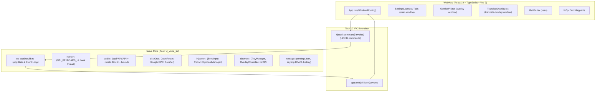

# Repository Guidelines

## Project

### Language

- MUST use tiếng Việt có dấu khi giao tiếp với người dùng và viết comments.
- MUST use tiếng Anh chuẩn cho naming conventions và coding (identifiers, function/method/class names, commit messages, commit nội dung mã).

<!-- gitnexus:start -->

# GitNexus — Code Intelligence

This project is indexed by GitNexus as **vt-voice** (1611 symbols, 2767 relationships, 123 execution flows). Use the GitNexus MCP tools to understand code, assess impact, and navigate safely.

> Index stale? Run `node .gitnexus/run.cjs analyze` from the project root — it auto-selects an available runner. No `.gitnexus/run.cjs` yet? `npx gitnexus analyze` (npm 11 crash → `npm i -g gitnexus`; #1939).

## Always Do

- **MUST run impact analysis before editing any symbol.** Before modifying a function, class, or method, run `impact({target: "symbolName", direction: "upstream"})` and report the blast radius (direct callers, affected processes, risk level) to the user.
- **MUST run `detect_changes()` before committing** to verify your changes only affect expected symbols and execution flows. For regression review, compare against the default branch: `detect_changes({scope: "compare", base_ref: "main"})`.
- **MUST warn the user** if impact analysis returns HIGH or CRITICAL risk before proceeding with edits.
- When exploring unfamiliar code, use `query({search_query: "concept"})` to find execution flows instead of grepping. It returns process-grouped results ranked by relevance.
- When you need full context on a specific symbol — callers, callees, which execution flows it participates in — use `context({name: "symbolName"})`.
- For security review, `explain({target: "fileOrSymbol"})` lists taint findings (source→sink flows; needs `analyze --pdg`).

## Never Do

- NEVER edit a function, class, or method without first running `impact` on it.
- NEVER ignore HIGH or CRITICAL risk warnings from impact analysis.
- NEVER rename symbols with find-and-replace — use `rename` which understands the call graph.
- NEVER commit changes without running `detect_changes()` to check affected scope.

## Resources
|Resource|Use for|
|---|---|
|`gitnexus://repo/vt-voice/context`|Codebase overview, check index freshness|
|`gitnexus://repo/vt-voice/clusters`|All functional areas|
|`gitnexus://repo/vt-voice/processes`|All execution flows|
|`gitnexus://repo/vt-voice/process/{name}`|Step-by-step execution trace|
## CLI
|Task|Read this skill file|
|---|---|
|Understand architecture / "How does X work?"|`.claude/skills/gitnexus/gitnexus-exploring/SKILL.md`|
|Blast radius / "What breaks if I change X?"|`.claude/skills/gitnexus/gitnexus-impact-analysis/SKILL.md`|
|Trace bugs / "Why is X failing?"|`.claude/skills/gitnexus/gitnexus-debugging/SKILL.md`|
|Rename / extract / split / refactor|`.claude/skills/gitnexus/gitnexus-refactoring/SKILL.md`|
|Tools, resources, schema reference|`.claude/skills/gitnexus/gitnexus-guide/SKILL.md`|
|Index, status, clean, wiki CLI commands|`.claude/skills/gitnexus/gitnexus-cli/SKILL.md`|
<!-- gitnexus:end -->

---

## Project Overview

`vt-voice` is a lightweight, low-latency Windows desktop utility for voice typing, AI text polishing, and on-screen selection translation. Built on **Tauri v2** with a native **Rust** backend (`vt_voice_lib`) and a **React 19 + TypeScript + Vite 7** frontend styled with **Tailwind CSS** and **Radix UI / shadcn**.

### Core Capabilities
- **Push-to-Talk / Hold-to-Record Voice Typing**: Global hotkeys capture audio via WASAPI, resample to 16kHz mono, transcribe with cloud STT (Groq / OpenRouter / custom OpenAI-compatible), and inject text directly into the focused window via simulated `Ctrl+V` with zero clipboard pollution.
- **Selection Translate Overlay**: Highlight text anywhere, trigger `Alt+T`, and view instant translations in a floating, non-activating popover (`WS_EX_NOACTIVATE`) powered by Google Translate RPC (primary) or OpenAI chat completions (fallback).
- **Multi-Provider AI Architecture**: Modular OpenAI-compatible provider engine (`ProviderManager`) with model allowlist caching (`%APPDATA%/.vt-voice/models.json`) and per-feature bindings (`stt`, `polish`, `translate`).
- **Secure Credential Vault**: API keys stored exclusively in Windows Credential Manager via DPAPI (`keyring` crate). Plaintext keys are never written to disk or config files.

---

## Architecture & Data Flow

### Two-Tier System Architecture



### Windows & Multi-Window Lifecycle
Defined in `src-tauri/tauri.conf.json`:
1. `main`: 720x560 settings dashboard. Default hidden; shown from tray or first run. `CloseRequested` is intercepted to hide to tray (`api.prevent_close()`).
2. `overlay`: 280x48 transparent, frameless, always-on-top pill at bottom-center of the screen. Non-activating (`WS_EX_NOACTIVATE`). Displays audio state: `Idle`, `Listening`, `Processing`, `Pasted`, `Error`.
3. `translate-overlay`: 340x150 floating popover positioned near cursor. Non-activating (`WS_EX_NOACTIVATE`, `SWP_NOACTIVATE`) so background applications retain focus.

### Data Pipelines

#### 1. Voice Typing Pipeline
1. Hook thread (`hotkey/hook.rs`) detects hold key press -> sends `HotkeyEvent::Pressed` over `crossbeam_channel::unbounded`.
2. Event loop (`lib.rs`) triggers `AudioRecorder::start()` (`audio/capture.rs`). Audio level RMS emitted as `audio-level` event every 50ms to update the overlay pill.
3. Hotkey released -> sends `HotkeyEvent::Released`.
4. `AudioRecorder::stop()` extracts ring buffer, downmixes to mono, resamples to 16kHz (`audio/resampler.rs`), and encodes PCM WAV (`audio/wav.rs`).
5. `transcribe_with_provider()` sends WAV to configured STT provider (`ai/provider.rs`).
6. Text passed through `polish_text()` (LLM or `LocalPolisher` fallback in `ai/fallback.rs`).
7. `ClipboardManager::paste_text()` (`injection/clipboard.rs` & `paste.rs`):
   - Snapshots current clipboard text.
   - Sets polished text with `ExcludeClipboardContentFromMonitorProcessing` flag to prevent clipboard manager tools from indexing transient text.
   - Injects `Ctrl+V` via Win32 `SendInput`.
   - Restores original clipboard content after short delay (only if original had text; non-text clipboards are never emptied).
8. Entry appended to `HistoryManager` (`storage/history.rs`) and persisted to `%APPDATA%/.vt-voice/history.json`.

#### 2. Selection Translation Pipeline
1. Hook thread detects `Alt+T` -> sends `HotkeyEvent::TranslateTrigger`.
2. `injection::selection::capture_selected_text()`:
   - Snapshots clipboard sequence number via `GetClipboardSequenceNumber()`.
   - Injects `Ctrl+C` via `SendInput`.
   - Polls for clipboard update with 250ms timeout.
   - Extracts selected text and immediately restores previous clipboard content.
3. `TranslateOverlayController::show_at_cursor()` opens `translate-overlay` window without stealing focus.
4. Backend emits `translate:payload` event with source text to frontend.
5. `ai::translate::translate_text()` translates text via Google Translate RPC (primary, 60s timeout) with OpenAI chat completions as fallback.
6. Backend emits `translate:result` with translated text and detected language.

---

## Key Directories

```
├── .github/
│   └── workflows/                # GitHub Actions workflows (ci.yml, release.yml)
├── src/                          # React 19 webview frontend
│   ├── assets/                   # Static icons & logos
│   ├── components/
│   │   ├── settings/             # Settings tabs: AiTab, AudioTab, GeneralTab, HistoryTab,
│   │   │                         #   HotkeyRecorder, SettingsLayout, providers/*
│   │   ├── ui/                   # Reusable Radix/shadcn primitives (button, dialog, input, etc.)
│   │   ├── OverlayPill.tsx       # Recording status pill (overlay window)
│   │   └── TranslateOverlay.tsx  # Floating translation popover (translate-overlay window)
│   ├── lib/
│   │   ├── i18n.tsx              # Zero-dependency typed React i18n context (vi/en)
│   │   ├── ipcErrorMapper.ts     # Maps backend error strings to localized UI messages
│   │   └── utils.ts              # Tailwind clsx/twMerge helper (cn)
│   ├── locales/                  # Translation dictionaries (en.json, vi.json)
│   ├── App.tsx                   # Top-level window router using getCurrentWebviewWindow().label
│   └── main.tsx                  # React entry point wrapped with I18nProvider
├── src-tauri/                    # Native Rust core (vt_voice_lib)
│   ├── capabilities/             # Tauri v2 security capabilities (default.json)
│   ├── examples/                 # Standalone diagnostic probes (e.g. verify_hotkey.rs, translate_overlay_key_probe.rs)
│   ├── src/
│   │   ├── ai/                   # Multi-provider STT, LLM polish, catalog cache, translation
│   │   ├── audio/                # cpal WASAPI capture, rubato resampler, hound WAV
│   │   ├── daemon/               # System tray, overlay window management, win32 native helpers
│   │   ├── hotkey/               # Low-level WH_KEYBOARD_LL hook & event loop
│   │   ├── injection/            # Win32 SendInput Ctrl+C/Ctrl+V, clipboard snapshot/restore
│   │   ├── storage/              # settings.json config, DPAPI keyring vault, history store, models_store
│   │   ├── lib.rs                # AppState, command handlers, background threads, app builder
│   │   └── main.rs               # Windows subsystem entry point
│   ├── tests/                    # Rust integration tests (audio, hotkeys, translation, clipboard)
│   ├── Cargo.toml                # Rust crate configuration (crate: vt-voice, lib: vt_voice_lib)
│   └── tauri.conf.json           # Tauri v2 application, window, and security configuration
├── scripts/                      # Release and changelog automation scripts (bump-version.ts, changelog.ts)
├── tests/                        # Frontend & integration tests (bun:test)
├── docs/                         # Architecture specs, design guidelines, verification guide
├── plans/                        # Implementation plans, architectural research, technical journals
├── cliff.toml                    # git-cliff Conventional Commits configuration
└── CHANGELOG.md                  # Generated project changelog
```

---

## Development Commands

Always run frontend and test commands using **Bun**.

### Building & Running
```bash
# Install frontend dependencies
bun install

# Run Vite dev server only (http://localhost:1420)
bun run dev

# Run full desktop application in development mode
bun run tauri dev

# Typecheck and build frontend
bun run build

# Check Rust backend compilation
cd src-tauri && cargo check

# Build production desktop installer/binary
bun run tauri build
```

### Testing & Verification
```bash
# Run all TypeScript / frontend tests via Bun (62 tests across 8 suites)
bun test

# Run a specific TypeScript test file
bun test tests/i18n.test.ts
bun test tests/history.test.ts
bun test tests/ipc-errors.test.ts
bun test tests/release-tooling.test.ts

# Run Rust backend test suite (from src-tauri directory)
cd src-tauri && cargo test
cd src-tauri && cargo test --test <test_name>      # e.g. hotkey_tests, audio_tests
cd src-tauri && cargo test --lib                  # Inline #[cfg(test)] unit tests
cd src-tauri && cargo test --test translate_tests -- --ignored  # Live network tests

# Run standalone Rust diagnostic examples
cd src-tauri && cargo run --example verify_hotkey
cd src-tauri && cargo run --example translate_overlay_key_probe
```

### Release & Changelog Tooling
```bash
# Generate or update full CHANGELOG.md from git history
bun run changelog

# Preview release notes for a specific tag
bun scripts/changelog.ts --tag v0.1.0

# Bump version across package.json, Cargo.toml, and tauri.conf.json
bun run version:patch
bun run version:minor
bun run version:major

# Bump version, update CHANGELOG.md, and auto-commit & tag in one step
bun scripts/bump-version.ts minor --git

# Push tag to trigger automated GitHub Actions release build
git push origin main --follow-tags
```

> **Testing Status Notes**:
> - **Rust `cargo test`**: On Windows, test binaries linking the full `vt_voice_lib` / Tauri stack encounter dynamic linker exit `0xc0000139 (STATUS_ENTRYPOINT_NOT_FOUND)`. For local Rust verification, rely on `cargo check` and standalone examples (`cargo run --example ...`) that isolate pure logic modules.
> - **Frontend `bun test`**: All 62 tests across 8 test suites pass cleanly with 0 failures (`i18n.test.ts`, `history.test.ts`, `confirm.test.ts`, `ipc-errors.test.ts`, `ui-localization.test.ts`, `release-tooling.test.ts`).
---

## Code Conventions & Common Patterns

### Naming Conventions
- **Rust**:
  - Modules, functions, variables, commands: `snake_case` (e.g. `capture_selected_text`, `get_history`).
  - Command handlers with name collision: append `_cmd` (e.g. `save_config_cmd`, `delete_provider_cmd`).
  - Structs, Enums, Traits: `PascalCase` (e.g. `AppState`, `AudioRecorder`).
  - Constants: `SCREAMING_SNAKE_CASE` (e.g. `TRANSLATE_OVERLAY_WINDOW_LABEL`).
  - Serde conventions:
    - Internal config structs: default `snake_case`.
    - DTOs sent to frontend (`HistoryItem`, translate payloads): `#[serde(rename_all = "camelCase")]`.
- **TypeScript / React**:
  - Components & Component files: `PascalCase` (e.g. `TranslateOverlay.tsx`, `HistoryTab.tsx`).
  - Hooks, utility functions, variables: `camelCase` (e.g. `useI18n`, `translateIpcError`).
  - Test files: `kebab-case.test.ts` (e.g. `ui-localization.test.ts`).
  - UI path alias: `@/*` resolves to `./src/*`.

### Error Handling Pattern
1. **Rust Backend**: Domain-specific error enums built with `thiserror` (e.g. `AiError`, `AudioError`, `KeyringError`, `SelectionError`).
2. **IPC Boundary**: Every `#[tauri::command]` returns `Result<T, String>`, mapping internal errors via `.to_string()`.
3. **Frontend Presentation**: Errors caught from `invoke()` must be routed through `translateIpcError(err, t)` in `src/lib/ipcErrorMapper.ts` to present localized, user-friendly messages.

```typescript
// Frontend pattern
try {
  await invoke("save_api_key", { provider, key });
} catch (err) {
  const message = translateIpcError(err, t);
  setError(message);
}
```

### State Management & Concurrency
- **Rust Shared State**: Centralized in `AppState` (`src-tauri/src/lib.rs`) using `Arc<parking_lot::Mutex<T>>` for subsystems (`AudioRecorder`, `HotkeyManager`, `ClipboardManager`, `OverlayController`, `AppConfig`, `HistoryManager`).
- **Hook Thread**: Native `WH_KEYBOARD_LL` hook runs on a dedicated OS thread (`std::thread`) with a standard Windows `GetMessageW` loop. Events are pushed to an unbounded `crossbeam_channel`.
- **Async Tasks**: The channel consumer dispatches CPU/IO-bound work using `tauri::async_runtime::spawn` so the Windows message loop is never blocked.
- **Frontend State**:
  - Window routing in `App.tsx` calls `getCurrentWebviewWindow().label` from `@tauri-apps/api/webviewWindow` (with try/catch fallback to `"main"`) to render `SettingsLayout`, `OverlayPill`, or `TranslateOverlay`.
  - Settings state is lifted in `SettingsLayout.tsx` and synced to the backend via `invoke()`.
  - Overlays are purely event-driven, listening to Tauri events (`listen("overlay-state", ...)`).

### Windows Native Window Invariants
- **Non-Activating Overlays**: Overlays (`overlay`, `translate-overlay`) MUST NOT steal focus from active windows. Use `WS_EX_NOACTIVATE` and `SWP_NOACTIVATE` via `src-tauri/src/daemon/win32.rs`.
- **NEVER** call `window.set_focus()` on overlay windows.
- **Clipboard Safety**: When injecting text or reading selections, never leave clipboard empty if it contained non-text items before capture.

### Internationalization (i18n)
- Custom typed i18n hook (`useI18n` in `src/lib/i18n.tsx`).
- Dictionaries in `src/locales/en.json` and `src/locales/vi.json`.
- **Invariance**: Every leaf key in `en.json` must exist in `vi.json` and vice versa. Verified by `tests/i18n.test.ts`.

---

## Important Files

| File | Purpose |
| --- | --- |
| `.github/workflows/ci.yml` | GitHub Actions CI workflow (Bun test, build, and Windows Rust cargo check). |
| `.github/workflows/release.yml` | GitHub Actions Release workflow (git-cliff, Tauri v2 Windows bundle, SHA-256 upload). |
| `cliff.toml` | git-cliff configuration for Conventional Commits changelog generation. |
| `scripts/bump-version.ts` | 3-way version synchronizer (`package.json`, `Cargo.toml`, `tauri.conf.json`) with git tag automation. |
| `scripts/changelog.ts` | Local and CI changelog & release notes generator running on Bun runtime. |
| `CHANGELOG.md` | Full project changelog adhering to Keep a Changelog & SemVer. |
| `src-tauri/src/main.rs` | Windows subsystem release configuration & binary entry point. |
| `src-tauri/src/lib.rs` | Application setup, `AppState` registration, IPC commands, and hotkey loop. |
| `src-tauri/tauri.conf.json` | Tauri configuration: window definitions, titles, dimensions, capabilities. |
| `src-tauri/capabilities/default.json` | Security capabilities declaring allowed Tauri core and plugin permissions. |
| `src-tauri/src/storage/keyring.rs` | DPAPI credential vault operations (store, retrieve, delete, mask keys). |
| `src-tauri/src/storage/config.rs` | Persistent app settings stored at `%APPDATA%/.vt-voice/settings.json`. |
| `src-tauri/src/storage/models_store.rs` | Model allowlist catalog stored at `%APPDATA%/.vt-voice/models.json`. |
| `src/main.tsx` | React root mounting `I18nProvider` and injecting dark mode CSS classes. |
| `src/App.tsx` | Multi-window router using `getCurrentWebviewWindow().label` to render subviews. |
| `src/lib/i18n.tsx` | Typed React context provider for Vietnamese and English locales. |
| `src/lib/ipcErrorMapper.ts` | Mapping table translating Rust error strings to localized UI error keys. |
| `src/components/TranslateOverlay.tsx` | Floating popover rendering translation results near the cursor. |
| `src/components/OverlayPill.tsx` | Always-on-top pill displaying voice typing recording/processing states. |

---

## Runtime & Tooling Preferences

- **JavaScript Runtime & Package Manager**: **Bun** is strictly preferred. The authoritative lockfile is `bun.lock`. Do not use npm or yarn.
- **Node.js**: Used only for tool runners if Bun is unavailable; `@types/node` is available for TS compiler.
- **Rust Toolchain**: Stable Rust 2021 edition targetting `x86_64-pc-windows-msvc`.
- **Platform Dependency**: Windows 10/11 64-bit only. The application relies on Win32 APIs (`windows-sys`), WASAPI audio capture (`cpal`), and Windows DPAPI (`keyring`).
- **Styling**: Tailwind CSS v3 with `tailwindcss-animate` using an obsidian/zinc dark theme palette.

---

## Testing & QA Expectations

1. **TypeScript Testing (`bun test`)**:
   - `tests/i18n.test.ts`: Verifies structural parity between `vi.json` and `en.json`, locale fallback logic, and template interpolation.
   - `tests/ipc-errors.test.ts`: Asserts that all known backend error strings map to valid i18n keys.
   - `tests/history.test.ts`: Validates 50-item history cap, deduplication, search filtering, and timestamp formatting.
   - `tests/confirm.test.ts`: Asserts contract and type exports of confirmation dialog primitives.
   - `tests/ui-localization.test.ts`: Scans UI components for hardcoded bilingual strings and verifies hotkey presets.
   - `tests/release-tooling.test.ts`: Asserts cliff configuration, 3-way version file synchronization, GitHub workflow integrity, and changelog release entries.
2. **Quality Invariants**:
   - **Zero Plaintext Secrets**: API keys must only pass through DPAPI `keyring`. Never write API keys to `settings.json`, logs, or console output.
   - **No Focus Stealing**: Overlays must always use `show_window_no_activate()` to protect user typing flow.
   - **Clipboard Preservation**: Clipboard snapshot and restore must handle non-text clipboard items gracefully without emptying or crashing.
   - **Diacritics Safety**: Vietnamese text must have proper vertical padding (`py-1.5` / `py-2`) to avoid clipping diacritical marks. Avoid `leading-none` on Vietnamese typography.
