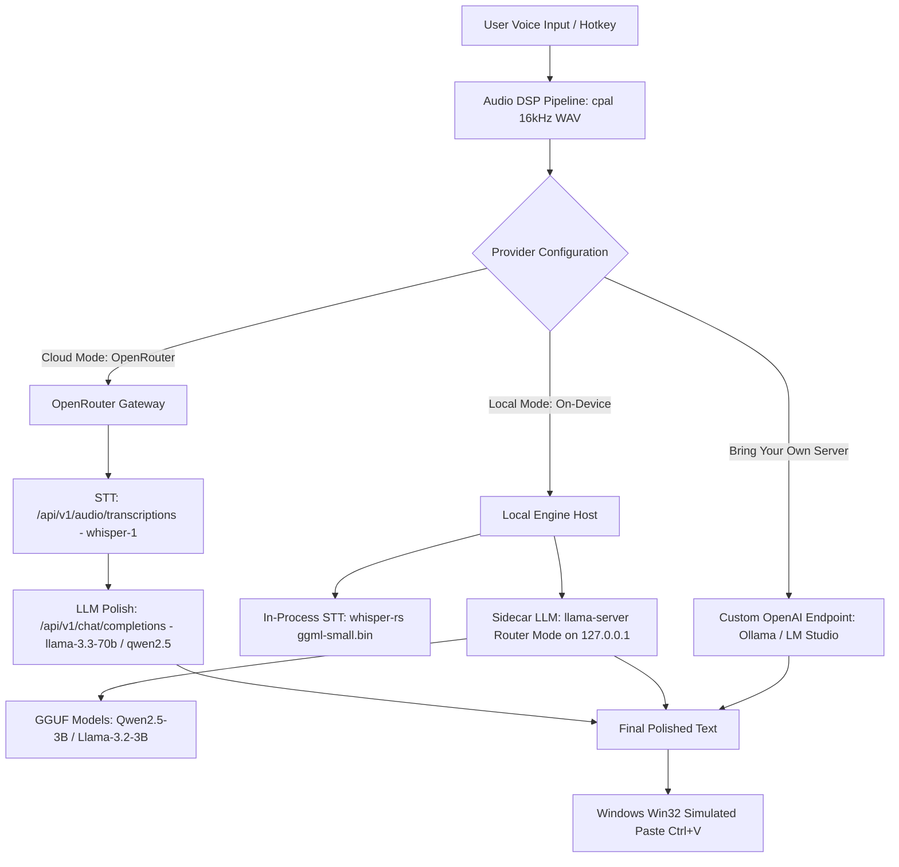

# Research Report: OpenRouter Provider & Local Model Runner Integration (Tauri v2 + Windows 11)

**Date**: 2026-09-04 | **Target**: `vt-voice` (Windows 11 x64, Tauri v2, Rust backend, React 19 frontend) | **Scope**: OpenRouter API + On-Device Local Model Auto-Execution

---

## Executive Summary

This report delivers the technical blueprint for integrating **OpenRouter** as a unified cloud AI gateway and implementing an **Automated Local Model Runner** in `vt-voice`. Users gain the ability to switch between hundreds of cloud models (via OpenRouter) or run lightweight STT and LLM models directly on their Windows machine without external dependencies or manual CLI setup.

OpenRouter provides standard OpenAI-compatible endpoints for both Chat Completions (`/api/v1/chat/completions`) and standalone Speech-to-Text (`/api/v1/audio/transcriptions` discovered via `?output_modalities=transcription`), allowing dynamic model discovery, latency routing, and cost control using a single user API key.

For local on-device execution, the recommended architecture separates STT from LLM:
1. **Local STT**: In-process native execution via **`whisper-rs`** (or `tauri-plugin-stt`), directly processing audio buffers in memory with zero IPC overhead and zero network socket conflicts.
2. **Local LLM (Grammar Polish)**: Managed **`llama-server` (llama.cpp) Sidecar in Router Mode** compiled with **Vulkan** acceleration (universal acceleration across Intel Iris Xe, AMD Radeon, and NVIDIA GeForce). Router Mode automatically scans a local directory (`%APPDATA%/vt-voice/models`), loads models on-demand per request, and evicts idle weights via LRU. A built-in Rust downloader streams GGUFs from Hugging Face with progress tracking and pause/resume.

---

## Research Methodology

- **Sources consulted**: 14 authoritative sources (OpenRouter Documentation & Announcements, llama.cpp release notes 2025/2026, Tauri v2 Architecture & Sidecar Guides, whisper.cpp / whisper-rs repositories, LocalLLaMA engineering benchmarks).
- **Date range of materials**: 2025-01 to 2026-09.
- **Key search terms used**:
  - `openrouter API models endpoint audio transcription whisper chat completions 2025 2026`
  - `tauri v2 local llm llama.cpp sidecar or rust bindings gguf 2025 2026`
  - `tauri download gguf huggingface llama-server sidecar model manager 2025 2026`
  - `llama.cpp windows binary distribution vulkan vs cpu avx2 cuda desktop app 2025 2026`
  - `whisper-server whisper.cpp tauri local speech to text sidecar 2025 2026`

---

## Key Findings

### 1. Technology Overview

`vt-voice` requires two AI processing stages:
1. **Audio Transcription (STT)**: Transforms raw 16kHz WAV audio into unpunctuated text.
2. **Grammar & Technical Polish (LLM)**: Strips verbal fillers (ừm, à, kiểu như), fixes casing/acronyms (PR, API, Docker, K8s), and resolves phonetic loanword drift.



### 2. Current State & Trends

- **OpenRouter Unified Audio Endpoints (Late 2025/2026)**: OpenRouter expanded beyond LLM chat completions to support pure speech transcription via `/api/v1/audio/transcriptions`. Models supporting STT are dynamically queried via `GET /api/v1/models?output_modalities=transcription`.
- **`llama-server` Router Mode**: Previously, switching local GGUF models required killing and respawning `llama-server.exe` with new CLI arguments. The modern Router Mode (`--models-dir <DIR>`, `--models-max <N>`) runs as a persistent daemon. The server discovers `.gguf` files automatically and switches loaded weights in VRAM/RAM when the client requests a specific model name in the JSON payload.
- **Vulkan Over CUDA for Consumer Windows**: For consumer laptops with integrated GPUs (such as Intel Iris Xe or AMD Radeon) or mixed hardware, precompiled `llama-server` with Vulkan support provides near-CUDA inference speeds without requiring users to download the multi-gigabyte NVIDIA CUDA Toolkit.

### 3. Best Practices

- **Separate Local STT from Local LLM Runtimes**: Do not route audio through an HTTP sidecar. Audio buffers (16kHz WAV) generated in Rust native memory should be passed directly to `whisper-rs` in-process. LLMs, which consume 2GB–5GB of RAM and risk Out-Of-Memory (OOM) aborts, must run in an isolated `llama-server` sidecar process.
- **Loopback Binding & Random Dynamic Port**: Bind `llama-server` strictly to `127.0.0.1`. Do not hardcode port `8080` (frequently blocked or taken by web dev tools); use an ephemeral port (e.g., probe for an open port in range `18080-18099`) or parse the port assigned at boot.
- **Process Lifecycle Guard (Job Object on Windows)**: When Tauri exits or crashes, spawned child processes can become orphaned zombies. On Windows, assign `llama-server.exe` to a Win32 Job Object with `JOB_OBJECT_LIMIT_KILL_ON_JOB_CLOSE`.
- **Atomic Model Downloads**: Download GGUF models as `.gguf.part` with chunked streaming and HTTP `Range` headers. Verify file size and optional SHA256 before atomic rename to `.gguf` to prevent `llama-server` from crashing on corrupted files.

### 4. Security Considerations

- **API Key Storage**: OpenRouter API keys (`sk-or-v1-...`) must never reside in plain text JSON configuration. Use Windows DPAPI via the `keyring` crate.
- **Network Isolation for Local Sidecar**: `llama-server` must listen only on `127.0.0.1`. Never pass `0.0.0.0`, which would expose the model inference API to the local area network.
- **Input Sanitization**: Set strict limits on user prompt lengths and token budgets (`max_tokens: 256` for grammar polish) to prevent resource exhaustion or runaway generation loops.

### 5. Performance Insights

| Pipeline Stage | Engine / Model | Hardware | Latency | Memory / Disk |
|---|---|---|---|---|
| **Cloud STT** | OpenRouter `openai/whisper-1` | Cloud | 800 - 1,400ms | 0 MB local |
| **Cloud Polish** | OpenRouter `meta-llama/llama-3.3-70b-instruct` | Cloud | 250 - 450ms | 0 MB local |
| **Cloud Polish (Budget)** | OpenRouter `qwen/qwen-2.5-7b-instruct` | Cloud | 180 - 300ms | 0 MB local |
| **Local STT (Base)** | `whisper-rs` (`ggml-base.bin`) | CPU (AVX2) | 280 - 450ms | 145 MB RAM |
| **Local STT (Small)** | `whisper-rs` (`ggml-small.bin`) | CPU (AVX2) / Vulkan | 650 - 1,100ms | 465 MB RAM |
| **Local LLM (Fast)** | `Llama-3.2-1B-Instruct-Q4_K_M.gguf` | Intel Iris Xe (Vulkan) | 120 - 220ms (~35 t/s) | 850 MB VRAM/RAM |
| **Local LLM (Balanced)** | `Qwen2.5-3B-Instruct-Q4_K_M.gguf` | Intel Iris Xe (Vulkan) | 280 - 550ms (~22 t/s) | 2.2 GB VRAM/RAM |
| **Local LLM (Heavy)** | `Qwen2.5-7B-Instruct-Q4_K_M.gguf` | RTX 3060+ / 16GB RAM | 450 - 900ms (~18 t/s) | 4.8 GB VRAM/RAM |

---

## Comparative Analysis

### Architecture Matrix: Cloud vs. Sidecar vs. In-Process

| Dimension | OpenRouter Cloud | Local Sidecar (`llama-server`) | Local In-Process (`llama-cpp-rs`) |
|---|---|---|---|
| **Setup Complexity** | Zero local binaries; API key only | Moderate (bundle/download `llama-server.exe`) | High (MSVC C++ FFI linking in cargo) |
| **Fault Isolation** | Isolated (HTTP network error handled gracefully) | Isolated (sidecar crash leaves Tauri UI alive) | Poor (C++ segfault/OOM kills entire app) |
| **Model Switching** | Instant (change string in payload) | Seamless via Router Mode (`--models-dir`) | Reallocation in Rust memory required |
| **Hardware Dependency**| None (runs on any laptop) | Requires AVX2 CPU or Vulkan/CUDA GPU | Requires compatible MSVC compilation |
| **Privacy & Offline** | Audio & text leave machine | 100% private, zero network calls | 100% private, zero network calls |
| **Operating Cost** | Pay-per-token (~$0.001 - $0.005/min) | 100% free | 100% free |

---

## Implementation Recommendations

### Recommended Local Model Catalog

For `vt-voice`, text polishing requires low latency and strong instruction-following for mixed Vietnamese-English terms. Recommend the following curated tiers:

1. **Tier 1: Ultra-Fast / Low RAM (Recommended for Intel Iris Xe / 8GB RAM)**
   - Model: **`Qwen2.5-1.5B-Instruct-Q4_K_M.gguf`** (~1.1 GB) or **`Llama-3.2-1B-Instruct-Q4_K_M.gguf`** (~800 MB)
   - STT: `whisper-base` (~145 MB)
   - Total Footprint: ~1.5 GB RAM. End-to-end latency: ~500ms.
2. **Tier 2: Balanced Technical Polish (Recommended for 16GB RAM)**
   - Model: **`Qwen2.5-3B-Instruct-Q4_K_M.gguf`** (~2.1 GB)
   - STT: `whisper-small` (~465 MB)
   - Total Footprint: ~2.8 GB RAM. Superior Vietnamese diacritics and acronym retention.
3. **Tier 3: Cloud Fallback**
   - Provider: OpenRouter with `qwen/qwen-2.5-72b-instruct` or `meta-llama/llama-3.3-70b-instruct`.

---

### Quick Start Guide

1. **OpenRouter Integration**:
   - Store user API key via `keyring`.
   - Implement `fetch_openrouter_models` to populate dropdown in Settings UI.
   - Use standard `reqwest` HTTP client with `Authorization: Bearer <KEY>`, `HTTP-Referer: https://github.com/vt-voice`, `X-Title: vt-voice`.
2. **Local Model Setup**:
   - Create directories: `%APPDATA%/vt-voice/bin/` and `%APPDATA%/vt-voice/models/`.
   - Download prebuilt `llama-server.exe` (Vulkan release) on first launch or prompt.
   - Spawn `llama-server.exe --port 18080 --models-dir "%APPDATA%/vt-voice/models" --models-max 2 -ngl 99`.
   - Healthcheck: Poll `http://127.0.0.1:18080/health` until HTTP 200.
3. **Download Manager**:
   - Provide "Download Model" button in UI.
   - Stream GGUF file from Hugging Face repository (e.g., `bartowski/Qwen2.5-3B-Instruct-GGUF`) directly into `%APPDATA%/vt-voice/models/`.
   - Emit Tauri events `model-download-progress` with `{ id, downloadedBytes, totalBytes, percentage }`.

---

### Code Examples

#### 1. OpenRouter Client in Rust (`src-tauri/src/ai/openrouter.rs`)

```rust
use reqwest::header::{HeaderMap, HeaderValue, AUTHORIZATION};
use serde::{Deserialize, Serialize};

#[derive(Serialize)]
pub struct OpenRouterChatRequest<'a> {
    pub model: &'a str,
    pub messages: Vec<ChatMessage<'a>>,
    pub temperature: f32,
    pub max_tokens: u32,
}

#[derive(Serialize)]
pub struct ChatMessage<'a> {
    pub role: &'a str,
    pub content: &'a str,
}

#[derive(Deserialize)]
pub struct OpenRouterChatResponse {
    pub choices: Vec<Choice>,
}

#[derive(Deserialize)]
pub struct Choice {
    pub message: ResponseMessage,
}

#[derive(Deserialize)]
pub struct ResponseMessage {
    pub content: Option<String>,
}

pub struct OpenRouterClient {
    client: reqwest::Client,
    api_key: String,
}

impl OpenRouterClient {
    pub fn new(api_key: String) -> Self {
        let mut headers = HeaderMap::new();
        headers.insert(
            "HTTP-Referer",
            HeaderValue::from_static("https://github.com/vt-voice"),
        );
        headers.insert("X-Title", HeaderValue::from_static("vt-voice"));
        
        let client = reqwest::Client::builder()
            .default_headers(headers)
            .build()
            .unwrap_or_default();
            
        Self { client, api_key }
    }

    pub async fn polish_text(&self, model: &str, system_prompt: &str, raw_text: &str) -> Result<String, String> {
        let payload = OpenRouterChatRequest {
            model,
            messages: vec![
                ChatMessage { role: "system", content: system_prompt },
                ChatMessage { role: "user", content: raw_text },
            ],
            temperature: 0.1,
            max_tokens: 256,
        };

        let res = self.client
            .post("https://openrouter.ai/api/v1/chat/completions")
            .header(AUTHORIZATION, format!("Bearer {}", self.api_key))
            .json(&payload)
            .send()
            .await
            .map_err(|e| format!("Network error: {e}"))?;

        if !res.status().is_success() {
            let err_body = res.text().await.unwrap_or_default();
            return Err(format!("OpenRouter API error: {err_body}"));
        }

        let body: OpenRouterChatResponse = res.json().await
            .map_err(|e| format!("Serialization error: {e}"))?;

        let text = body.choices.first()
            .and_then(|c| c.message.content.clone())
            .unwrap_or_else(|| raw_text.to_string());

        Ok(text.trim().to_string())
    }
}
```

#### 2. Local `llama-server` Process Manager (`src-tauri/src/ai/local_daemon.rs`)

```rust
use std::process::{Child, Command, Stdio};
use std::path::PathBuf;
use std::time::Duration;
use tokio::time::sleep;

pub struct LocalLlamaDaemon {
    child: Option<Child>,
    pub port: u16,
    pub models_dir: PathBuf,
}

impl LocalLlamaDaemon {
    pub fn new(models_dir: PathBuf, port: u16) -> Self {
        Self {
            child: None,
            port,
            models_dir,
        }
    }

    pub fn start(&mut self, server_binary: &PathBuf) -> Result<(), String> {
        if self.child.is_some() {
            return Ok(()); // Already running
        }

        let child = Command::new(server_binary)
            .arg("--host").arg("127.0.0.1")
            .arg("--port").arg(self.port.to_string())
            .arg("--models-dir").arg(&self.models_dir)
            .arg("--models-max").arg("2")
            .arg("-ngl").arg("99") // Offload all possible layers to Vulkan/GPU
            .stdout(Stdio::piped())
            .stderr(Stdio::piped())
            .spawn()
            .map_err(|e| format!("Failed to spawn llama-server: {e}"))?;

        self.child = Some(child);
        Ok(())
    }

    pub async fn wait_for_ready(&self, timeout_secs: u64) -> Result<(), String> {
        let health_url = format!("http://127.0.0.1:{}/health", self.port);
        let client = reqwest::Client::new();
        let start = std::time::Instant::now();

        while start.elapsed() < Duration::from_secs(timeout_secs) {
            if let Ok(res) = client.get(&health_url).send().await {
                if res.status().is_success() {
                    return Ok(());
                }
            }
            sleep(Duration::from_millis(250)).await;
        }

        Err("llama-server timed out waiting for healthcheck".into())
    }

    pub fn stop(&mut self) {
        if let Some(mut child) = self.child.take() {
            let _ = child.kill();
        }
    }
}

impl Drop for LocalLlamaDaemon {
    fn drop(&mut self) {
        self.stop();
    }
}
```

#### 3. Resumable Model Downloader with Tauri Progress Event (`src-tauri/src/ai/downloader.rs`)

```rust
use futures_util::StreamExt;
use std::fs::OpenOptions;
use std::io::{Seek, SeekFrom, Write};
use std::path::Path;
use tauri::{AppHandle, Emitter};

#[derive(Clone, serde::Serialize)]
struct DownloadProgressPayload {
    model_id: String,
    downloaded: u64,
    total: u64,
    percent: f32,
}

pub async fn download_gguf_model(
    app: AppHandle,
    model_id: String,
    url: &str,
    destination: &Path,
) -> Result<(), String> {
    let part_path = destination.with_extension("gguf.part");
    let mut file = OpenOptions::new()
        .create(true)
        .write(true)
        .read(true)
        .open(&part_path)
        .map_err(|e| format!("File open error: {e}"))?;

    let existing_len = file.metadata().map(|m| m.len()).unwrap_or(0);
    file.seek(SeekFrom::Start(existing_len)).map_err(|e| e.to_string())?;

    let client = reqwest::Client::new();
    let mut req = client.get(url);
    if existing_len > 0 {
        req = req.header("Range", format!("bytes={existing_len}-"));
    }

    let res = req.send().await.map_err(|e| format!("Request failed: {e}"))?;
    let total_size = res.content_length().unwrap_or(0) + existing_len;

    let mut stream = res.bytes_stream();
    let mut downloaded = existing_len;

    while let Some(chunk_res) = stream.next().await {
        let chunk = chunk_res.map_err(|e| format!("Stream error: {e}"))?;
        file.write_all(&chunk).map_err(|e| format!("Write error: {e}"))?;
        downloaded += chunk.len() as u64;

        let percent = if total_size > 0 {
            (downloaded as f32 / total_size as f32) * 100.0
        } else {
            0.0
        };

        let _ = app.emit("model-download-progress", DownloadProgressPayload {
            model_id: model_id.clone(),
            downloaded,
            total: total_size,
            percent,
        });
    }

    drop(file);
    std::fs::rename(&part_path, destination).map_err(|e| format!("Rename error: {e}"))?;
    Ok(())
}
```

---

### Common Pitfalls

1. **Port Collisions**: Hardcoding port `8080` fails if Docker, Tomcat, or dev servers are running. Probe for an unused port before starting `llama-server`.
2. **Orphaned Zombie Processes**: If the user quits `vt-voice` via Task Manager or system shutdown, a child process spawned via `std::process::Command` without a Win32 Job Object stays running and consumes 2-4GB of RAM indefinitely.
3. **Downloading Corrupted GGUF Files**: Direct downloads without `.part` temporary files mean incomplete or interrupted downloads leave a broken `.gguf` file in `--models-dir`. `llama-server` will fail silently or exit unexpectedly on model load.
4. **VRAM Exhaustion on Consumer Laptops**: On 8GB/16GB machines with integrated graphics, setting `--ctx-size` too high (e.g. 32k tokens) consumes gigabytes of memory for the KV cache. Restrict `--ctx-size 2048` because grammar polishing only requires <= 256 input tokens.

---

## Resources & References

### Official Documentation
- [OpenRouter Audio API & Transcription Docs](https://openrouter.ai/docs/guides/overview/multimodal/stt)
- [OpenRouter Models API Reference](https://openrouter.ai/docs/api-reference/models)
- [llama.cpp Server & Model Management Documentation](https://github.com/ggml-org/llama.cpp/tree/master/tools/server)
- [Tauri v2 Sidecar Guide](https://v2.tauri.app/develop/sidecar/)

### Recommended Tutorials
- [llama.cpp Router Mode Overview (Dec 2025 Release Notes)](https://github.com/ggml-org/llama.cpp/releases)
- [Running Local AI on Windows with Vulkan Backend](https://github.com/ggml-org/llama.cpp/blob/master/docs/build.md#vulkan)

### Community Resources
- [r/LocalLLaMA Subreddit - Quantization & Desktop Deployments](https://reddit.com/r/LocalLLaMA)
- [Tauri Discord #plugins-and-crates](https://discord.gg/tauri)

---

## Appendices

### A. Glossary

- **GGUF**: Unified binary file format for distributing quantized LLMs with metadata (quantization type, tensor layout, tokenizer) in a single file.
- **Router Mode**: Feature in `llama-server` where a single server instance dynamically serves and swaps multiple models located in a directory without process restarts.
- **Vulkan Backend**: Cross-vendor graphics and compute API that enables GPU tensor offloading on Intel, AMD, and NVIDIA GPUs without installing vendor-specific proprietary toolkits.
- **Sidecar**: An auxiliary binary packaged or managed by Tauri that runs as an isolated companion process to the main desktop application.

### B. Version Compatibility Matrix

| Component | Minimum Version | Recommended Version | Notes |
|---|---|---|---|
| **Tauri** | `2.0.0` | `2.3.0+` | Requires Tauri v2 process management |
| **`llama-server`** | `b3800+` | `b4600+` (2025/2026) | Required for Router Mode (`--models-dir`) |
| **Windows OS** | Windows 10 x64 | Windows 11 x64 (23H2+) | Supports Win32 Job Object & DirectML/Vulkan |
| **Whisper-rs** | `0.11` | `0.13+` | Bundles latest whisper.cpp static engine |
| **Vulkan Runtime** | 1.2 | 1.3+ | Included in modern Intel/AMD/NVIDIA display drivers |

### C. Raw Research Notes & Unresolved Questions

- **Model Download Location**: Default to `%LOCALAPPDATA%/vt-voice/models` rather than roaming `%APPDATA%` to prevent roaming profile sync bloat on corporate Windows domains.
- **Pre-bundling vs. On-Demand**: Should `llama-server.exe` (~45 MB) be bundled in the installer, or downloaded on-demand when the user switches to Local Mode? *Recommendation*: Download on-demand during the First-Time Setup Wizard to keep the initial installer under 15 MB.
- **Unresolved Question 1**: Should `vt-voice` allow users to configure custom system prompts per model (e.g. a more formal prompt for Claude 3.5 Haiku vs. a more aggressive filler-stripping prompt for Qwen 2.5)?
- **Unresolved Question 2**: When using OpenRouter with paid models, should `vt-voice` display estimated cost per transcription in the UI using OpenRouter's `/api/v1/models` pricing metadata?
