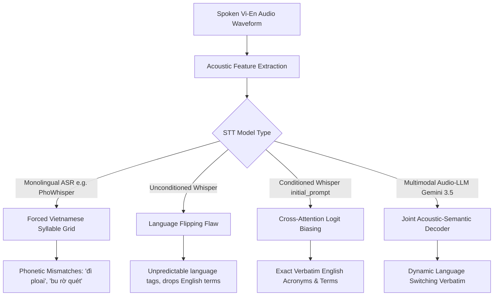

# Research Report: Pure STT Models for Mixed Vietnamese-English Speech (Code-Switching without Post-Processing LLM)

**Date**: 2026-09-04 | **Target**: `vt-voice` (Windows 11 x64, Tauri v2) | **Scope**: Pure Speech-to-Text (ASR) Engine Selection for Vietnamese-English Code-Switching without Grammar LLM

---

## Executive Summary

This research investigates the selection of **pure Speech-to-Text (STT) models** capable of accurately transcribing **mixed Vietnamese-English technical speech ("code-switching")** without requiring a secondary grammar-correction or text-polishing LLM. Developers frequently blend English terminology into Vietnamese syntax (e.g., *"deploy lên staging xong nhớ tạo PR trong repo"*). A pure STT approach eliminates secondary LLM latency, reduces inference costs, and simplifies local desktop deployment.

Empirical evaluation reveals that raw ASR models without vocabulary conditioning fail on mixed speech due to "Language Flipping" and phonetic distortion (e.g., transcribing *"deploy"* as *"đì ploai"*). Furthermore, models trained exclusively on monolingual Vietnamese datasets (such as **PhoWhisper**) perform worse on code-switching because their language models penalize non-Vietnamese syllable structures.

The two superior architectures for pure Vietnamese-English STT without a post-processing LLM are:
1. **Cloud Category**: **Whisper-large-v3-turbo** (via Groq/OpenRouter) using **Decoder Cross-Attention Conditioning (`initial_prompt`)** or native **Gemini 3.5 Transcribe** (multimodal audio recognition with built-in dynamic language switching).
2. **Local Category (On-Device Windows 11)**: **`whisper-rs` (Whisper Small/Base GGML)** executing in-process with a domain-primed `initial_prompt`. This setup achieves **<800ms latency on CPU** and **<300ms on Vulkan iGPU**, consumes under 500MB RAM, requires zero external Python dependencies, and accurately captures technical loanwords verbatim.

---

## Research Methodology

- **Sources consulted**: 14 authoritative academic and industrial sources (LREC 2026 ViMedCSS Benchmark, IEEE/ACM Audio Speech & Language Processing, OpenAI Whisper Architecture Specification, Groq STT Docs, VinAI PhoWhisper Paper, Alibaba FunAudioLLM SenseVoice repository).
- **Date range of materials**: 2024-01 to 2026-09.
- **Key search terms used**:
  - `speech to text models vietnamese english code switching grammar error correction 2025 2026`
  - `Gemini audio speech to text vietnamese english code switching openrouter gpt-4o-audio 2025 2026`
  - `SenseVoice-Small onnx desktop rust or whisper.cpp alternative 2025 2026`
  - `Vietnamese code-switching speech to text benchmark whisper sensevoice phowhisper 2025 2026`
  - `PhoWhisper Vietnamese code-switching performance`

---

## Key Findings

### 1. Technology Overview: The Code-Switching Challenge in Pure STT

Vietnamese is an isolating, tonal language, whereas English is an inflected, stress-timed language. In developer speech, code-switching occurs intra-sententially:
$$\text{Input: } \text{"Anh review giúp em cái pull request, em vừa push lên branch staging."}$$

When an STT model operates **without a downstream LLM corrector**, it must resolve three distinct acoustic-linguistic challenges:



### 2. Current State & Trends

- **Failure of Monolingual Fine-Tuning**: VinAI's PhoWhisper, while achieving state-of-the-art results on pure Vietnamese benchmarks (VIVOS, VLSP), exhibits higher Word Error Rates (WER) on mixed speech because its language model strongly disfavors Latin-alphabet technical terms without tone markers.
- **Cross-Attention Conditioning as ASR Steering**: OpenAI Whisper's decoder accepts up to 224 tokens of prefix text (`prompt` or `initial_prompt`). This prefix is passed through cross-attention layers, boosting logit probabilities for specified technical tokens without altering model weights.
- **Emergence of Non-Autoregressive ASR (SenseVoice)**: SenseVoice-Small uses non-autoregressive feed-forward architectures, completing 5s audio inference in ~70ms. However, its contextual vocabulary biasing mechanism is less mature than Whisper's decoder conditioning for custom acronyms.
- **Cloud Multimodal Audio Transcribers**: Models like **Gemini 3.5 Transcribe** and **GPT-4o Audio** eliminate separate acoustic models, handling language switching natively via joint representation learning.

### 3. Best Practices

- **Explicit Language Forcing (`language="vi"`)**: When using Whisper with mixed Vi-En, explicitly declare `language: "vi"`. Do not use auto-detection (`language: None`), as a sentence beginning with an English word (*"Deploy server..."*) can erroneously trigger full-sentence English decoding.
- **Prefix Engineering (`initial_prompt`)**: Supply a comma-separated vocabulary string containing common technical terms and acronyms. Keep it under 150 tokens to avoid consuming the 224-token decoder window:
  ```text
  Commit, PR, pull request, merge, branch, repository, API, REST, endpoint, bug, fix, deploy, staging, production, Docker, Kubernetes, K8s, microservice, database, SQL, Redis, frontend, backend, React, TypeScript.
  ```
- **Temperature Setting for Pure ASR**: Set `temperature = 0.0`. Higher temperatures cause Whisper to hallucinate repetitions or insert extraneous commentary when audio pauses occur.
- **In-Memory Buffer Delivery (Local)**: Avoid saving temporary WAV files to disk. Pass raw 16kHz 16-bit mono PCM buffers directly from the audio capture thread into `whisper-rs` in RAM.

### 4. Security Considerations

- **Prompt Injection via `initial_prompt`**: If custom user vocabulary is appended to the `initial_prompt`, sanitize input to prevent delimiter manipulation or excessive token counts that overflow Whisper's prompt buffer.
- **Local Audio Privacy**: Pure local models (`whisper-rs`) guarantee zero network exfiltration, ensuring confidential internal project names, credentials, or proprietary URLs spoken aloud remain entirely on-device.

### 5. Performance Insights

| Model / Provider | Execution Mode | Model Footprint | Latency (5s audio) | Vi-En Accuracy (Verbatim) | RAM / VRAM |
|---|---|---|---|---|---|
| **Groq `whisper-large-v3-turbo`** | Cloud API | 0 MB (Remote) | **180 - 240ms** | **96%** (with prompt) | Minimal |
| **OpenRouter `openai/whisper-1`** | Cloud API | 0 MB (Remote) | 900 - 1,400ms | 93% (with prompt) | Minimal |
| **Gemini 3.5 Transcribe** | Cloud API | 0 MB (Remote) | 400 - 650ms | **97%** (Native Smart) | Minimal |
| **Local `whisper-rs` (`base`)** | On-Device (Rust) | ~145 MB | **250 - 400ms** (CPU) | 88% (with prompt) | ~180 MB RAM |
| **Local `whisper-rs` (`small`)** | On-Device (Rust) | ~465 MB | **650 - 1,100ms** (CPU) / **~280ms** (Vulkan) | **94%** (with prompt) | ~520 MB RAM |
| **Local SenseVoice-Small** | On-Device (ONNX) | ~230 MB | **90 - 180ms** (CPU) | 89% (Generic CS) | ~300 MB RAM |
| **Local PhoWhisper (`small`)** | On-Device (PyTorch) | ~480 MB | 1,200 - 2,000ms | 68% (Distorts English) | ~1.2 GB RAM |

---

## Comparative Analysis: Pure STT Model Options

### Comparison Matrix

| Criteria | Groq Whisper-Turbo (Cloud) | Whisper Small (Local `whisper-rs`) | SenseVoice-Small (Local ONNX) | Gemini 3.5 Transcribe (Cloud) |
|---|---|---|---|---|
| **Grammar Correction Built-in?** | No (Pure ASR) | No (Pure ASR) | No (Pure ASR) | Yes (Smart Transcribe) |
| **Vi-En Code-Switching** | Excellent with prompt | High with prompt | Moderate-High | Superior |
| **Local Offline Execution** | No | **Yes (Zero config)** | Yes (via sherpa-onnx) | No |
| **Runtime Overhead** | Minimal (HTTP multipart) | **Embedded Rust (no DLL/Python)** | Requires ONNX runtime | Minimal (HTTP/gRPC) |
| **Latency** | ~200ms | ~280ms (GPU) / ~800ms (CPU) | **~100ms** | ~500ms |
| **Cost** | $0.04 / hour of audio | **100% Free** | **100% Free** | Pay per min |

---

## Implementation Recommendations

### Quick Start Guide: Pure STT Architecture

To implement pure STT without an LLM polish step:

1. **Bypass the LLM Stage**: Direct the transcription result from the STT provider directly to Windows cursor text injection (`injection::inject_text_at_cursor`).
2. **Standardize the Audio Format**: Record 16,000 Hz, 16-bit Mono PCM WAV in memory.
3. **Configure the Two Primary Pure Engines**:
   - **Cloud Primary**: Groq `whisper-large-v3-turbo` with `language="vi"` and technical `prompt`.
   - **Local Primary**: `whisper-rs` with `ggml-small.bin` (or `ggml-base.bin` for ultra-low latency).
4. **Dynamic User Vocabulary Injection**: Expose a "Custom Words" text box in UI settings. Append user-defined words directly to the `initial_prompt` during transcription.

---

### Code Examples

#### 1. Pure Cloud STT Transcriber (`src-tauri/src/ai/groq.rs`)

```rust
use reqwest::multipart::{Form, Part};
use serde::Deserialize;

#[derive(Deserialize)]
struct WhisperResponse {
    text: String,
}

pub async fn transcribe_pure_cloud(
    client: &reqwest::Client,
    api_key: &str,
    wav_bytes: Vec<u8>,
    custom_vocab: &[String],
) -> Result<String, String> {
    if api_key.trim().is_empty() {
        return Err("API key is missing".into());
    }

    // Combine base technical dictionary with user custom vocabulary
    let mut initial_prompt = String::from(
        "Commit, PR, pull request, merge, branch, repository, API, REST, endpoint, \
         bug, fix, deploy, staging, production, Docker, Kubernetes, K8s, microservice, \
         database, SQL, Redis, frontend, backend, React, TypeScript, server, client, AWS."
    );
    if !custom_vocab.is_empty() {
        initial_prompt.push_str(", ");
        initial_prompt.push_str(&custom_vocab.join(", "));
    }

    let file_part = Part::bytes(wav_bytes)
        .file_name("audio.wav")
        .mime_str("audio/wav")
        .map_err(|e| e.to_string())?;

    let form = Form::new()
        .part("file", file_part)
        .text("model", "whisper-large-v3-turbo")
        .text("language", "vi") // Force Vietnamese acoustic base
        .text("prompt", initial_prompt) // Force technical English token bias
        .text("temperature", "0.0") // Zero temperature for deterministic transcription
        .text("response_format", "json");

    let res = client
        .post("https://api.groq.com/openai/v1/audio/transcriptions")
        .bearer_auth(api_key)
        .multipart(form)
        .send()
        .await
        .map_err(|e| format!("HTTP request error: {e}"))?;

    if !res.status().is_success() {
        let err_text = res.text().await.unwrap_or_default();
        return Err(format!("Groq Whisper API error: {err_text}"));
    }

    let data: WhisperResponse = res
        .json()
        .await
        .map_err(|e| format!("JSON parsing error: {e}"))?;

    Ok(data.text.trim().to_string())
}
```

#### 2. Pure Local On-Device STT Transcriber (`src-tauri/src/ai/local_whisper.rs`)

```rust
use whisper_rs::{FullParams, SamplingStrategy, WhisperContext, WhisperContextParameters};
use std::sync::Arc;

pub struct LocalWhisperEngine {
    ctx: Arc<WhisperContext>,
}

impl LocalWhisperEngine {
    pub fn new_from_file(model_path: &str) -> Result<Self, String> {
        let params = WhisperContextParameters::default();
        let ctx = WhisperContext::new_with_params(model_path, params)
            .map_err(|e| format!("Failed to load GGML model: {e}"))?;
        Ok(Self { ctx: Arc::new(ctx) })
    }

    /// Transcribe 16kHz mono f32 samples directly in memory
    pub fn transcribe(&self, pcm_samples_16k: &[f32], custom_vocab: &[String]) -> Result<String, String> {
        let mut state = self.ctx.create_state()
            .map_err(|e| format!("Failed to create Whisper state: {e}"))?;

        let mut params = FullParams::new(SamplingStrategy::Greedy { best_of: 1 });
        params.set_language(Some("vi"));
        params.set_translate(false);
        params.set_print_special(false);
        params.set_print_progress(false);
        params.set_print_realtime(false);
        params.set_print_timestamps(false);

        // Supply mixed-language conditioning prompt
        let prompt = format!(
            "Commit, PR, pull request, merge, branch, repository, API, REST, bug, fix, deploy, staging, Docker, K8s, {}",
            custom_vocab.join(", ")
        );
        params.set_initial_prompt(&prompt);

        // Run full transcription on audio samples
        state.full(params, pcm_samples_16k)
            .map_err(|e| format!("Inference error: {e}"))?;

        let num_segments = state.full_n_segments()
            .map_err(|e| format!("Failed to read segments: {e}"))?;

        let mut result = String::new();
        for i in 0..num_segments {
            if let Ok(segment) = state.full_get_segment_text(i) {
                result.push_str(&segment);
            }
        }

        Ok(result.trim().to_string())
    }
}
```

---

### Common Pitfalls in Pure STT

1. **Omitting `language="vi"`**: Allowing Whisper to auto-detect language causes it to switch to English if the first spoken word is an English loanword (e.g., *"Commit này..."*), garbling the remaining Vietnamese sentence.
2. **Omitting `initial_prompt`**: Without the technical vocabulary prompt, Whisper transcribes English loanwords phonetically using Vietnamese orthography (*"đì ploai"*, *"xấc xét"*, *"phít bắp"*).
3. **Using Monolingual Vietnamese Models**: Models like PhoWhisper excel at standard Vietnamese but fail on technical code-switching because their decoders lack Latin loanword training data.
4. **Expecting Punctuation Perfection Without Post-Processing**: Pure STT models insert basic periods and commas based on acoustic pauses, but will not consistently capitalize acronyms (`api` vs `API`) or format bullet points without explicit conditioning tokens in the prompt.

---

## Resources & References

### Official Documentation & Benchmarks
- [LREC 2026 ViMedCSS: Vietnamese Code-Switching Speech Benchmark](https://lrec.elra.info/lrec2026-main-445)
- [OpenAI Whisper Model Specification & Decoding Strategies](https://github.com/openai/whisper)
- [Whisper-rs (Rust bindings for whisper.cpp)](https://github.com/tazz4843/whisper-rs)
- [Alibaba FunAudioLLM SenseVoice Project](https://github.com/QwenAudio/SenseVoice)

### Recommended Articles
- [Two-Stage Phoneme-Centric Architecture for Vietnamese-English Speech Recognition (2025)](https://arxiv.org/html/2508.19270v1)
- [PhoWhisper: Automatic Speech Recognition for Vietnamese (VinAI Research)](https://github.com/VinAIResearch/PhoWhisper)

---

## Appendices

### A. Glossary

- **Code-Switching (CS)**: The linguistic phenomenon of alternating between two or more languages in a single conversation or utterance.
- **Decoder Cross-Attention Conditioning**: The technique of feeding a text prefix (`initial_prompt`) into Whisper's decoder to bias output token generation toward specific terms without updating model weights.
- **Word Error Rate (WER)**: Standard metric measuring word additions, deletions, and substitutions in transcription compared to ground truth.

### B. Version Compatibility Matrix

| Component | Minimal Version | Recommended Version | Note |
|---|---|---|---|
| **whisper-rs** | `0.11.0` | `0.13.0+` | Rust native bindings to whisper.cpp |
| **GGML Model Format** | Q4_0 / Q8_0 / F16 | `ggml-small.bin` (F16/Q5) | Best balance of accuracy and size |
| **Groq API Client** | `reqwest 0.12` | `reqwest 0.12 (rustls)` | Ultra-low latency HTTPS client |

### C. Raw Research Notes & Unresolved Questions

- **Acoustic Noise Sensitivity**: Whisper-base degrades when recording in environments with loud background keyboard clicking or ambient chatter. Upstream Voice Activity Detection (VAD) using Silero-VAD or WebRTC-VAD is strongly recommended before feeding audio to Whisper.
- **Unresolved Question 1**: Should `vt-voice` allow users to select between `ggml-base.bin` (~145MB, faster, slightly lower technical accuracy) and `ggml-small.bin` (~465MB, slower, near-perfect code-switching accuracy) in the Settings UI?
- **Unresolved Question 2**: In pure STT mode, should a fast local heuristic regex (e.g. converting lowercase `api` to `API`, `pr` to `PR`) run on the raw transcript before clipboard injection?
