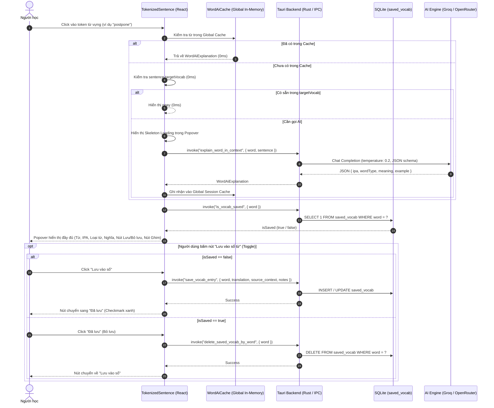

# Research & Technical Advice: Popup Dịch Từ Vựng AI & Lưu Sổ Từ Tức Thì (Contextual Vocab Popover & Quick Save)

**Ngày thực hiện:** 2026-09-22  
**Dự án:** `vt-voice` (`vocab` study mode)  
**Mục tiêu:** Tra cứu từ vựng chuyên sâu bằng AI và Lưu/Bỏ lưu 1-chạm (Toggle) vào Sổ từ vựng SQLite ngay khi click vào từ trong câu hỏi.  
**Tài liệu liên quan:** `docs/architecture.md`, `src/components/settings/vocab/TokenizedSentence.tsx`, `src-tauri/src/storage/learn_db.rs`

---

## 1. Tóm tắt điều hành (Executive Summary)

Trong tab học từ vựng và luyện dịch (`StudyMode`), khi người học gặp một từ lạ trong câu hỏi, họ cần:
1. **Hiểu ngữ nghĩa tức thì và sâu sắc**: Biết phiên âm IPA, loại từ, nghĩa tiếng Việt chính xác theo ngữ cảnh của câu đang học, kèm ví dụ hoặc cụm từ đi kèm (Collocation).
2. **Thu thập từ vựng không gián đoạn**: Bấm 1-click để lưu từ đó (kèm nghĩa AI và câu gốc) vào Sổ từ vựng (`saved_vocab` trong SQLite), hoặc bấm lại để bỏ lưu nếu đã có sẵn.
3. **Zero Focus Stealing**: Thao tác mở popup và lưu từ tuyệt đối không cướp focus của ô gõ bài (`textarea`), giúp mạch gõ phím luyện dịch được liên tục.

Tài liệu này tổng hợp toàn bộ phân tích kỹ thuật, các quyết định sau đợt phỏng vấn kỹ thuật chuyên sâu (Technical Interview), kiến trúc luồng dữ liệu và danh sách công việc triển khai chi tiết.

---

## 2. Các quyết định cốt lõi sau phỏng vấn (Confirmed Decisions)

| Hạng mục | Quyết định của người dùng | Lý do & Phân tích kỹ thuật |
|---|---|---|
| **Mục tiêu cốt lõi** | Tra cứu tức thì & lưu từ mới vào sổ ôn tập | Vừa giải quyết bế tắc khi gặp từ lạ để tiếp tục dịch, vừa xây dựng kho từ vựng cá nhân để ôn tập lâu dài. |
| **Cân bằng tương tác** | Click mở Popup (tích hợp nút Ghim & Lưu) | Click bình thường vào từ mở Popup. Nút "Ghim từ" (`notedWords`) được đưa vào trong Popup để người dùng chủ động ghim từ cho AI chấm bài sau đó. |
| **Nguồn giải nghĩa** | AI chuyên sâu mọi lúc (1.5 - 3s/từ) | Người học chấp nhận độ trễ 1.5 - 3 giây để đổi lấy định nghĩa ngữ cảnh sâu sắc (IPA, loại từ, nghĩa theo câu) thay vì nghĩa từ điển cơ học. |
| **Quản lý Cache & Request** | Global Session Cache vĩnh viễn trong phiên | Lưu kết quả AI vào bộ nhớ đệm toàn cục; click lại từ đã tra (ở bất kỳ câu nào) hiển thị ngay 0ms, không gọi lại LLM; hủy request cũ khi đổi từ liên tiếp. |
| **Trạng thái Sổ từ vựng** | Toggle Lưu / Bỏ lưu (Checkmark xanh) | Tự động kiểm tra SQLite: nếu từ đã có, nút hiển thị icon Checkmark "Đã lưu", bấm lại để xóa khỏi sổ từ; nếu chưa có, bấm để lưu từ kèm nghĩa và câu ngữ cảnh. |

---

## 3. Kiến trúc & Luồng dữ liệu (Architecture & Data Flow)



---

## 4. Lời khuyên kỹ thuật & Đánh đổi (Technical Advice & Trade-offs)

### 4.1 Những việc BẠN NÊN LÀM (Do's)
1. **Zero Focus Stealing**: Cấu hình Popover của Radix UI với `onOpenAutoFocus={(e) => e.preventDefault()}`. Người học gõ phím trong `textarea` không bị mất focus hay nhảy con trỏ chuột.
2. **0ms Pre-check**: Trước khi gọi LLM, kiểm tra xem từ đó có nằm trong `sentence.targetVocab` (gói bài tập tự trị đã sinh sẵn) hay không. Nếu có, hiển thị ngay 0ms, tiết kiệm 100% token cho từ đó.
3. **AbortController cho các click liên tiếp**: Khi người học click liên tiếp nhiều từ, hủy ngay request đang chờ của từ trước đó để tránh race-condition và không làm lãng phí băng thông/token.
4. **Fallback Google Translate khi AI lỗi**: Nếu LLM timeout (> 4s) hoặc hết quota API, tự động fallback gọi lệnh `translate_text` (Google Translate RPC) để người dùng luôn nhận được nghĩa cơ bản.

### 4.2 Những việc BẠN TUYỆT ĐỐI TRÁNH (Don'ts)
1. **KHÔNG dùng prompt văn bản tự do**: Phải ép schema JSON nghiêm ngặt với `max_tokens: 120` và `temperature: 0.2` để tốc độ sinh từ của LLM đạt cực đại (< 1.5s).
2. **KHÔNG xóa tính năng "Ghim từ" (`notedWords`)**: Tích hợp nút Ghim trực tiếp trong Popover và đồng bộ 2 chiều với dải tag từ vựng bên dưới câu hỏi.
3. **KHÔNG để Popover che khuất ô nhập liệu**: Sử dụng `side="bottom" | "top"` và `collisionPadding={8}` để Popover tự động đổi hướng khi câu hỏi nằm sát mép cửa sổ.

---

## 5. Thiết kế giao diện (UI/UX Mockup)

```
 ┌────────────────────────────────────────────────────────┐
 │ Câu hỏi: The company decided to postpone the meeting.  │
 │                             ▲                          │
 │                    ┌────────┴─────────────────┐        │
 │                    │ postpone  /pəʊstˈpəʊn/   │        │
 │                    │ [verb] hoãn lại, dời lại │        │
 │                    │ Ví dụ: postpone the game │        │
 │                    ├──────────────────────────┤        │
 │                    │ [⭐ Lưu vào sổ] [📌 Ghim] │        │
 │                    └──────────────────────────┘        │
 └────────────────────────────────────────────────────────┘
```

- **Từ & Phiên âm**: `font-semibold text-zinc-100`, IPA màu `zinc-400 font-mono text-xs`.
- **Loại từ & Nghĩa**: Badge loại từ `text-[10px] bg-zinc-800 text-zinc-300`, nghĩa tiếng Việt `text-xs text-emerald-300 font-medium`.
- **Nút Lưu vào sổ**:
  - Khi chưa lưu: `bg-zinc-800 hover:bg-zinc-700 text-zinc-200`.
  - Khi đã lưu: `bg-emerald-950/60 border border-emerald-500/40 text-emerald-300`.
- **Nút Ghim từ**:
  - Đồng bộ trực tiếp với danh sách `notedWords` của câu học.

---

## 6. Kế hoạch triển khai & Tiêu chí đo lường (Work Checklist & Metrics)

### 6.1 Bảng công việc (Work Checklist)
- [ ] **Backend IPC (`src-tauri/src/lib.rs`)**:
  - Thêm `save_vocab_cmd(word, translation, source_context, notes)`.
  - Thêm `delete_saved_vocab_by_word_cmd(word)`.
  - Thêm `is_vocab_saved_cmd(word) -> bool`.
- [ ] **Backend AI Engine (`src-tauri/src/ai/learn.rs`)**:
  - Thêm hàm `explain_word_in_context(client, base_url, api_key, model, word, sentence)`.
  - Định nghĩa schema JSON: `{ ipa: String, word_type: String, meaning: String, example: Option<String> }`.
- [ ] **Frontend Types (`src/components/settings/vocab/types.ts`)**:
  - Định nghĩa `WordAiExplanation`.
- [ ] **Frontend Global Cache (`src/components/settings/vocab/wordCache.ts`)**:
  - Singleton `Map<string, WordAiExplanation>` lưu trữ kết quả trong phiên.
- [ ] **Frontend Component (`WordDetailPopover.tsx`)**:
  - Component Popover bọc quanh token từ vựng.
  - Tích hợp Skeleton Loading, nút Toggle Lưu, nút Ghim.
- [ ] **Tích hợp `TokenizedSentence.tsx`**:
  - Cập nhật sự kiện click token từ vựng để kích hoạt Popover.
- [ ] **i18n & Kiểm thử**:
  - Bổ sung các key song ngữ vào `vi.json` và `en.json`.
  - Kiểm thử `bun test tests/i18n.test.ts` và `bun run build`.

### 6.2 Tiêu chí thành công (Success Metrics)
1. **Zero Focus Loss**: Click tra từ không làm mất caret ở ô `textarea` soạn thảo (100% không mất focus).
2. **0ms Cache Hit**: Mọi từ đã tra trong phiên khi click lại lần 2 hiển thị nghĩa ngay tức thì (< 5ms).
3. **Toggle Bền vững**: Bấm "Lưu vào sổ" -> từ xuất hiện ngay trong SQLite `saved_vocab`; bấm lại "Bỏ lưu" -> từ bị xóa khỏi SQLite ngay lập tức.
4. **Song ngữ & Build sạch**: 100% đối xứng song ngữ `vi.json` / `en.json`, `bun run build` và `cargo check` không lỗi.
