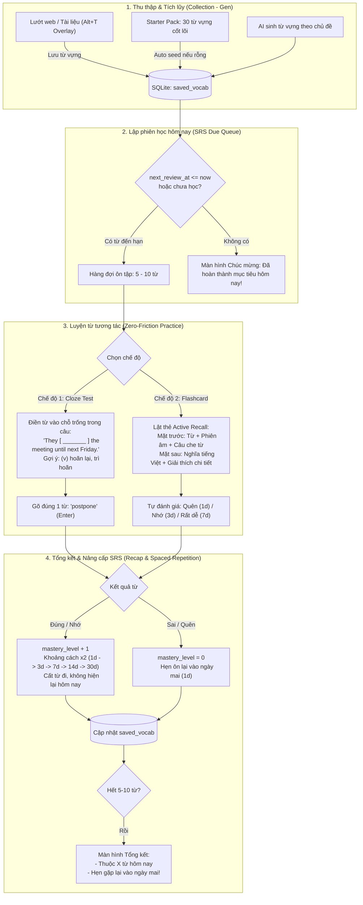

# Research & Architecture Spec: Thiết Kế Lại Vòng Lặp Học Từ Vựng Chuyên Sâu (Vocab-Centric SRS Learning Loop)

**Ngày thực hiện:** 2026-09-23  
**Dự án:** `vt-voice` (`vocab` study mode)  
**Quyết định kiến trúc cốt lõi (Core Pivot):**  
> **"Dịch cả câu là không cần thiết. Thuật toán lặp lại ngắt quãng (SRS) chỉ dành cho Từ vựng, câu chỉ đóng vai trò là Ngữ cảnh ví dụ (Example Context)."**  
> Chuyển đổi toàn diện từ mô hình *Sentence Translation* (bắt gõ cả câu 20 từ gây ức chế) sang mô hình *Vocab-Centric In-Context Learning* (Luyện từ vựng trong câu qua Cloze / Flashcard siêu nhẹ).

---

## 1. Bản chất vấn đề: Tại sao flow cũ "khó học" và "vẫn hiện câu cũ"?

```
[Mô hình cũ - Sai đối tượng]
Câu văn dài 20 từ ➔ Ép dịch cả câu từ đầu đến cuối ➔ So khớp từng chữ máy móc (Myers diff) ➔ Bị trừ điểm vì mạo từ/giới từ ➔ Chán nản, bỏ học.

[Mô hình mới - Đúng bản chất ngôn ngữ]
Từ vựng mới (Word) ➔ Đặt trong Câu ngữ cảnh (Context) ➔ Chỉ cần nhớ & gõ 1 TỪ DUY NHẤT (Cloze/Card) ➔ Nhớ sâu, học siêu nhanh (1-2 phút/phiên).
```

### So sánh chi tiết

| Tiêu chí | Mô hình cũ (Sentence-Centric) | Mô hình mới (Vocab-Centric SRS) |
|---|---|---|
| **Đơn vị học tập (Unit)** | Một câu văn độc lập (`study_sentences`) | **Từ vựng / Cụm từ (`saved_vocab`)** |
| **Vai trò của câu** | Là bài kiểm tra bắt dịch toàn bộ | **Là Ngữ cảnh ví dụ (Context Sentence)** giúp người học thấy cách từ được dùng trong thực tế |
| **Thao tác người học** | Gõ lại 15–20 từ tiếng Anh trong `textarea` | **Chỉ gõ 1 từ khóa vào ô đục lỗ (Cloze)** hoặc **Lật thẻ Flashcard (Active Recall)** |
| **Chấm điểm** | So khớp chuỗi nghiêm ngặt, sai 1 mạo từ rớt điểm | **Chỉ đánh giá đúng/sai từ khóa** (hỗ trợ dạng nguyên thể / chia thì) |
| **Cơ chế SRS** | Không có trạng thái, luôn hiện lại 15 câu cũ | **SRS gắn trực tiếp vào từ vựng** ($1d \rightarrow 3d \rightarrow 7d \rightarrow 14d \rightarrow 30d$). Thuộc rồi sẽ biến mất, chỉ hiện khi đến hạn |
| **Thời gian 1 phiên** | 10–15 phút căng thẳng, mỏi tay | **60–90 giây nhẹ nhàng, cuốn hút** |

---

## 2. Kiến trúc Vòng Lặp Học Từ Vựng Chuẩn: Thu thập ➔ Lập phiên ➔ Luyện từ ➔ Thăng cấp SRS



---

## 3. Thiết kế CSDL: Nâng cấp Bảng `saved_vocab` thành SRS Engine

Bảng `saved_vocab` hiện tại đã có cấu trúc rất tốt:
* `id`, `word_or_phrase`, `source_context`, `translation`, `notes`, `created_at`.

### 3.1 Migration bổ sung các trường SRS vào `saved_vocab`

```sql
-- Migration bổ sung vào fn run_migrations() trong learn_db.rs
ALTER TABLE saved_vocab ADD COLUMN mastery_level INTEGER NOT NULL DEFAULT 0;
ALTER TABLE saved_vocab ADD COLUMN interval_days INTEGER NOT NULL DEFAULT 0;
ALTER TABLE saved_vocab ADD COLUMN next_review_at INTEGER NOT NULL DEFAULT 0;
ALTER TABLE saved_vocab ADD COLUMN review_count INTEGER NOT NULL DEFAULT 0;
ALTER TABLE saved_vocab ADD COLUMN last_reviewed_at INTEGER DEFAULT NULL;

-- Index phục vụ lấy từ đến hạn tức thì
CREATE INDEX IF NOT EXISTS idx_vocab_srs ON saved_vocab(next_review_at ASC, mastery_level ASC);
```

### 3.2 Thuật toán Leitner SRS cho Từ Vựng

Khi người học hoàn thành ôn tập một từ:
1. **Làm đúng / Đánh giá "Nhớ" / "Dễ":**
   * Nếu `mastery_level == 0`: `interval_days = 1` ngày.
   * Nếu `mastery_level == 1`: `interval_days = 3` ngày.
   * Nếu `mastery_level == 2`: `interval_days = 7` ngày.
   * Nếu `mastery_level == 3`: `interval_days = 14` ngày.
   * Nếu `mastery_level >= 4`: `interval_days = 30` ngày (Thành thạo - Mastered).
   * `mastery_level = min(mastery_level + 1, 5)`.
   * `next_review_at = now + (interval_days * 86,400,000)`.
   * `review_count += 1`.
2. **Làm sai / Đánh giá "Quên":**
   * `mastery_level = 0`.
   * `interval_days = 1` (phải ôn lại ngay ngày hôm sau).
   * `next_review_at = now + 86,400,000`.
   * `review_count += 1`.

### 3.3 Truy vấn Từ Vựng Đến Hạn Hôm Nay (`get_due_vocab`)

```rust
pub fn get_due_vocab(&self, limit: usize) -> Result<Vec<SavedVocab>, LearnDbError> {
    let now = chrono::Utc::now().timestamp_millis();
    let mut stmt = self.conn.prepare(
        "SELECT id, word_or_phrase, source_context, translation, notes, created_at,
                mastery_level, interval_days, next_review_at, review_count, last_reviewed_at
         FROM saved_vocab
         WHERE next_review_at <= ?1 OR last_reviewed_at IS NULL
         ORDER BY
            CASE WHEN last_reviewed_at IS NULL THEN 0 ELSE 1 END ASC,
            next_review_at ASC,
            mastery_level ASC
         LIMIT ?2"
    )?;
    // Map rows ...
}
```

* **Kết quả:** Từ nào làm xong sẽ có `next_review_at` ở tương lai $\rightarrow$ **lập tức biến mất khỏi hàng đợi học**. Ngày hôm sau mở ứng dụng lên chỉ thấy từ đến hạn, giải quyết 100% hiện tượng "vẫn hiện câu cũ".

---

## 4. Thiết kế Giao diện Bài Tập Siêu Nhẹ (Zero-Friction UI)

### 4.1 Chế độ Cloze Test (Điền từ vào chỗ trống trong câu ngữ cảnh)

Người học nhìn thấy câu ngữ cảnh thực tế, nhưng chỉ cần gõ đúng 1 từ duy nhất:

```
+-------------------------------------------------------------------+
|  ÔN TẬP TỪ VỰNG HÔM NAY                           [Từ 3 / 5]      |
+-------------------------------------------------------------------+
|                                                                   |
|   "They [  postpone  ] the meeting until next Friday."            |
|                                                                   |
|   Gợi ý: (verb) hoãn lại, trì hoãn                                |
|   Phiên âm: /pəʊstˈpəʊn/                                          |
|                                                                   |
|   [  postpone                   ]   [  Kiểm tra (Enter)  ]        |
|                                                                   |
|   Phím tắt: Enter để kiểm tra | Space để xem gợi ý chữ đầu       |
+-------------------------------------------------------------------+
```

#### Quy tắc so khớp cực kỳ thông minh:
* Người học gõ `postpone` hoặc `postponed` $\rightarrow$ **Đúng (100 điểm)**!
* Hệ thống so sánh gốc từ (Stemming) hoặc cho phép sai khác dạng chia thì (Inflection: `postpone` / `postponed` / `postponing`).
* Không kiểm tra mạo từ, không bắt dịch phần còn lại của câu!

---

### 4.2 Chế độ Flashcard (Lật thẻ Active Recall)

Dành cho người thích ôn tập nhanh bằng mắt và phím số ($1, 2, 3, 4$):

```
+-------------------------------------------------------------------+
|  MẶT TRƯỚC (Nhấn Phím Cách để lật thẻ):                           |
|                                                                   |
|              postpone                                             |
|              /pəʊstˈpəʊn/                                         |
|                                                                   |
|   Ngữ cảnh: "They ______ the meeting until next Friday."          |
+-------------------------------------------------------------------+
                                 ▼ Lật thẻ (Space)
+-------------------------------------------------------------------+
|  MẶT SAU:                                                         |
|                                                                   |
|   Nghĩa: hoãn lại, trì hoãn                                       |
|   Loại từ: verb                                                   |
|   Ví dụ: We decided to postpone the holiday.                      |
|                                                                   |
|   [1] Quên (1d)    [2] Khó (2d)    [3] Nhớ (4d)    [4] Dễ (7d)    |
+-------------------------------------------------------------------+
```

---

## 5. Màn hình Kết thúc Phiên (Session Recap)

Sau khi hoàn thành 5 từ trong phiên:
* **Thống kê:**
  * *"Tuyệt vời! Bạn đã hoàn thành 5 từ vựng hôm nay."*
  * 4 từ lên cấp Mastery tiếp theo $\rightarrow$ hẹn gặp lại sau 3–7 ngày.
  * 1 từ cần ôn lại $\rightarrow$ hẹn gặp lại vào ngày mai.
* **Tùy chọn:**
  * Nút: *"Học thêm 5 từ mới"* (nếu còn từ trong sổ).
  * Nút: *"Nghỉ ngơi"*.

---

## 6. Kế hoạch Chuyển Đổi (Transition Plan)

1. **Bảo toàn dữ liệu cũ:** Bảng `saved_vocab` đã lưu sẵn từ vựng của người dùng, chỉ cần chạy migration thêm cột SRS.
2. **Starter Pack từ vựng mẫu:** Seed 30 từ vựng thông dụng kèm câu ví dụ (`source_context`) và nghĩa (`translation`) vào `saved_vocab` nếu CSDL rỗng.
3. **Thay thế UI Tab Vocab:**
   * Thay thế màn hình gõ cả câu dài ngoằng bằng giao diện **Ôn tập Từ vựng SRS** (hỗ trợ Cloze & Flashcard).
   * Giữ lại tab Sổ tay từ vựng (`VocabNotebook`) để xem/sửa/xóa từ như bình thường.
4. **Loại bỏ toàn bộ điểm nghẽn cũ:**
   * Không còn lỗi phím Enter nhảy câu.
   * Không còn lỗi câu dán điểm 0.
   * Không còn việc so sánh từ tiếng Việt với từ tiếng Anh lệch hướng.
