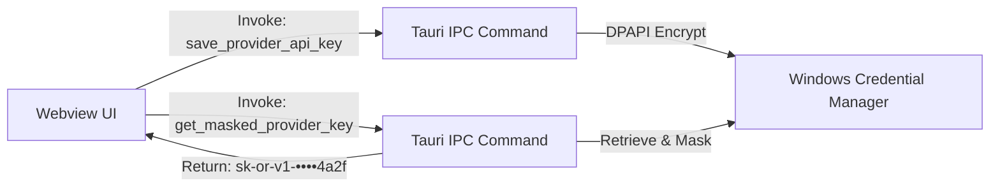

# Phase 1: Multi-Provider Key Security & Vault Architecture

## Overview
Re-architect the credential storage subsystem from a single hardcoded Groq key into a multi-provider vault using Windows DPAPI (Windows Credential Manager via the `keyring` crate). Introduce key masking and IPC isolation so sensitive keys are never exposed in plaintext to the webview UI or logged to disk.

## Requirements
- Functional:
  - Support distinct storage keys for `groq`, `openrouter`, and `custom` providers in Windows Credential Vault.
  - Provide APIs to check existence (`has_key`), retrieve masked representation, save, and delete keys per provider.
  - Update `AppConfig` in `settings.json` to store `active_provider`, `stt_model`, `enable_polish`, and optional `custom_endpoint` without storing any raw API keys.
- Non-functional & Security:
  - Zero plaintext API keys written to filesystem (`settings.json` or debug logs).
  - Webview receives only masked strings (e.g. `sk-or-v1-••••••••ef31`) on settings load.
  - Redact API keys from all error messages and debug outputs.

## Architecture
- **Service Name**: `vt-voice`
- **Account Names in Vault**:
  - `groq_api_key`
  - `openrouter_api_key`
  - `custom_api_key`
- **Masking Algorithm**:
  - For keys $\ge$ 12 characters: preserve first 4 characters and last 4 characters, replace middle with 8 bullet points (`••••••••`).
  - For shorter keys: return `••••••••`.

## Related Code Files
- Modify: `src-tauri/src/storage/keyring.rs`
- Modify: `src-tauri/src/storage/config.rs`
- Modify: `src-tauri/src/lib.rs`

## Implementation Steps
1. Refactor `src-tauri/src/storage/keyring.rs`:
   - Replace hardcoded `USER_KEY` with dynamic provider mapping:
     - `fn get_account_name(provider: &str) -> String`
   - Implement `set_provider_key(provider: &str, key: &str) -> Result<(), KeyringError>`.
   - Implement `get_provider_key(provider: &str) -> Result<Option<String>, KeyringError>`.
   - Implement `delete_provider_key(provider: &str) -> Result<(), KeyringError>`.
   - Implement `has_provider_key(provider: &str) -> bool`.
   - Implement helper `mask_key(key: &str) -> String`.
2. Update `AppConfig` in `src-tauri/src/storage/config.rs`:
   - Add field `pub active_provider: String` (defaults to `"groq"`).
   - Add field `pub custom_endpoint: Option<String>`.
   - Add field `pub enable_polish: bool` (defaults to `true`).
   - Ensure `stt_model` defaults to `"whisper-large-v3-turbo"` for Groq and `"openai/whisper-1"` for OpenRouter.
3. Expose Tauri commands in `src-tauri/src/lib.rs`:
   - `save_provider_api_key(provider: String, key: String) -> Result<(), String>`
   - `get_masked_provider_api_key(provider: String) -> Result<Option<String>, String>`
   - `has_provider_api_key(provider: String) -> Result<bool, String>`
   - `delete_provider_api_key(provider: String) -> Result<(), String>`

## Success Criteria
- [x] Groq and OpenRouter keys can be saved, checked, and deleted independently in Windows Credential Vault.
- [x] Querying masked key returns formatted bullets (e.g. `sk-or-••••••••abcd`) and never plain text.
- [x] `settings.json` contains `active_provider`, `enable_polish`, and `stt_model`, but zero API keys.
- [x] Unit tests pass for key masking logic with various string lengths.
- [x] Credential storage is strictly local DPAPI, no export/import mechanism. <!-- Updated: Validation Session 1 - Credential storage strictly local DPAPI, no file export -->

## Risk Assessment
- **Risk**: Windows Credential Manager service disabled or restricted on locked-down enterprise machines.
  - *Signal*: `KeyringError::Keyring` on credential save.
  - *Mitigation*: Fallback to app-specific DPAPI-encrypted binary blob in `%LOCALAPPDATA%/com.itvan.vt-voice/secure.dat` via `windows-sys` `CryptProtectData`.
