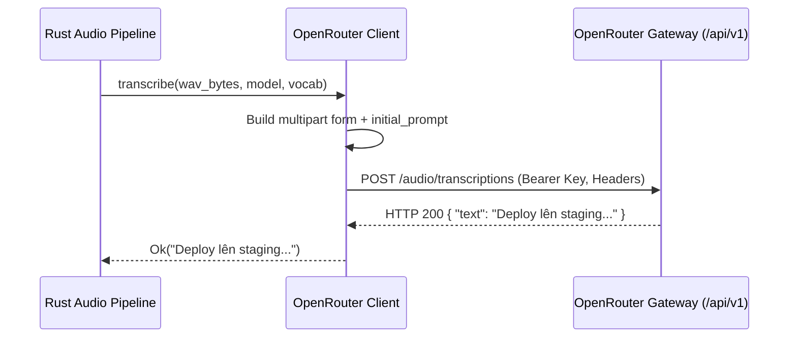

# Phase 2: OpenRouter & OpenAI-Compatible STT Engine

## Overview

Implement an OpenAI-compatible audio transcription client targeting OpenRouter's `/api/v1/audio/transcriptions` endpoint. Include custom attribution headers (`HTTP-Referer`, `X-Title`), multipart audio uploads with primed code-switching vocabulary prompts, error normalization, and connection latency testing.

## Requirements

- Functional:
  - Transcribe in-memory WAV audio bytes via OpenRouter's `/api/v1/audio/transcriptions` API.
  - Send obligatory OpenRouter identification headers: `HTTP-Referer: https://github.com/vt-voice` and `X-Title: vt-voice`.
  - Inject Vietnamese-English technical code-switching vocabulary into the transcription `prompt` parameter with `language: "vi"`.
  - Implement a fast connection test endpoint checking API key validity and network round-trip latency.
  - Support generic Custom OpenAI-compatible endpoints (e.g. self-hosted Whisper or vLLM audio endpoints).
- Non-functional:
  - Robust timeout handling (60s upstream limit on OpenRouter audio).
  - Secure error mapping: sanitize raw HTTP response bodies so API keys are never surfaced.

## Architecture



## Related Code Files

- Create: `src-tauri/src/ai/openrouter.rs`
- Create: `src-tauri/src/ai/provider.rs`
- Modify: `src-tauri/src/ai/mod.rs`
- Modify: `src-tauri/src/ai/client.rs`

## Implementation Steps

1. Create `src-tauri/src/ai/openrouter.rs`:
   - Define constants:
     - `OPENROUTER_BASE_URL: &str = "https://openrouter.ai/api/v1"`
     - `OPENROUTER_AUDIO_URL: &str = "https://openrouter.ai/api/v1/audio/transcriptions"`
     - `OPENROUTER_AUTH_KEY_URL: &str = "https://openrouter.ai/api/v1/auth/key"`
   - Implement `transcribe_openrouter(http: &AiHttpClient, api_key: &str, model: &str, wav_bytes: Vec<u8>, custom_vocab: &[String]) -> Result<String, AiError>`.
   - Ensure `Part::bytes(wav_bytes).file_name("audio.wav").mime_str("audio/wav")`.
   - Include form fields:
     - `model`: selected model name (default: `openai/whisper-1`).
     - `language`: `"vi"`.
     - `temperature`: `"0.0"`.
     - `prompt`: `DEFAULT_INITIAL_PROMPT` + user custom vocabulary.
   - Implement `test_openrouter_connection(http: &AiHttpClient, api_key: &str) -> Result<u64, AiError>`.
2. Create `src-tauri/src/ai/provider.rs`:
   - Define enum `AiProvider { Groq, OpenRouter, Custom(String) }`.
   - Implement unified dispatcher:
     ```rust
     pub async fn transcribe_with_provider(
         provider: &str,
         http: &AiHttpClient,
         api_key: &str,
         model: &str,
         wav_bytes: Vec<u8>,
         custom_vocab: &[String],
         custom_endpoint: Option<&str>,
     ) -> Result<String, AiError>
     ```
3. Expose test connection command in `src-tauri/src/lib.rs`:
   - `test_provider_connection(provider: String, api_key: String, endpoint: Option<String>) -> Result<u64, String>`

## Success Criteria

- [x] Successful audio transcription via OpenRouter `/api/v1/audio/transcriptions` with model `openai/whisper-1`.
- [x] OpenRouter test connection returns accurate roundtrip latency (ms) and detects invalid keys (HTTP 401).
- [x] Mixed Vietnamese-English technical words are preserved in output text due to `prompt` priming.
- [x] HTTP requests pass required OpenRouter headers (`HTTP-Referer`, `X-Title`).
- [x] Provider errors report transparently to UI overlay without silent auto-fallback. <!-- Updated: Validation Session 1 - Transparent error reporting without silent auto-fallback -->

## Risk Assessment

- **Risk**: OpenRouter audio transcription upstream timeout (OpenRouter has a 60s max upstream limit).
  - *Signal*: `AiError::Network(reqwest::Error::is_timeout)`.
  - *Mitigation*: Client timeout clamped to 25 seconds; returns clean user-facing error message advising shorter speech snippets.
