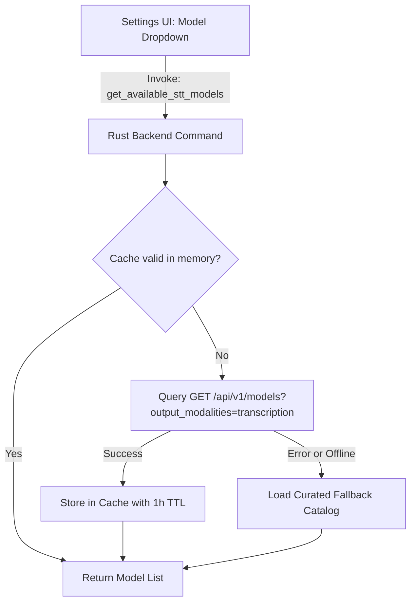

# Phase 3: Dynamic STT Model Discovery & Caching

## Overview
Implement dynamic model discovery for Speech-to-Text models. For OpenRouter, query `GET /api/v1/models?output_modalities=transcription` to retrieve available transcription models. For all providers, provide an offline curated fallback catalog and in-memory caching with TTL to guarantee instant, flicker-free UI rendering.

## Requirements
- Functional:
  - Query OpenRouter's Models API to dynamically fetch models supporting the `transcription` output modality.
  - Parse model identifiers, friendly names, context length, and pricing information.
  - Maintain an offline curated fallback list for both Groq (`whisper-large-v3-turbo`, `whisper-large-v3`) and OpenRouter (`openai/whisper-1`).
  - Cache dynamic model lists in memory with a 1-hour Time-To-Live (TTL) or manual refresh option.
- Non-functional:
  - Resilient to network outages: never block the UI or fail if the user is offline; seamlessly serve cached/fallback models.

## Architecture



## Related Code Files
- Create: `src-tauri/src/ai/catalog.rs`
- Modify: `src-tauri/src/ai/mod.rs`
- Modify: `src-tauri/src/lib.rs`

## Implementation Steps
1. Create `src-tauri/src/ai/catalog.rs`:
   - Define data models:
     ```rust
     #[derive(Debug, Clone, Serialize, Deserialize)]
     pub struct SttModelInfo {
         pub id: String,
         pub name: String,
         pub description: Option<String>,
         pub provider: String,
         pub is_recommended: bool,
     }
     ```
   - Define static fallback catalogs:
     - Groq:
       - `whisper-large-v3-turbo` (Name: "Whisper Large v3 Turbo (Siêu nhanh, <250ms)", is_recommended: true)
       - `whisper-large-v3` (Name: "Whisper Large v3 (Chính xác cao)", is_recommended: false)
     - OpenRouter:
       - `openai/whisper-1` (Name: "OpenAI Whisper v2 (Chuẩn OpenRouter)", is_recommended: true)
   - Implement `fetch_openrouter_stt_models(client: &reqwest::Client, api_key: Option<&str>) -> Result<Vec<SttModelInfo>, AiError>`.
   - Implement thread-safe caching via `parking_lot::Mutex<Option<(Instant, Vec<SttModelInfo>)>>`.
2. Expose Tauri command in `src-tauri/src/lib.rs`:
   - `get_available_stt_models(provider: String, force_refresh: bool) -> Result<Vec<SttModelInfo>, String>`

## Success Criteria
- [x] Calling `get_available_stt_models("openrouter", false)` queries OpenRouter and returns list of transcription-capable models.
- [x] Calling `get_available_stt_models("groq", false)` returns Groq Whisper models with recommended tags.
- [x] In offline mode, the function gracefully returns the fallback catalog without throwing errors.
- [x] Subsequent calls within 1 hour return cached data instantly (< 5ms).

## Risk Assessment
- **Risk**: OpenRouter's `?output_modalities=transcription` endpoint format changes or returns empty array if no specialized models are registered under that filter.
  - *Signal*: OpenRouter response `data` has length 0.
  - *Mitigation*: Fallback check: if dynamic response has 0 models, merge in `openai/whisper-1` default model so the dropdown is never empty.
