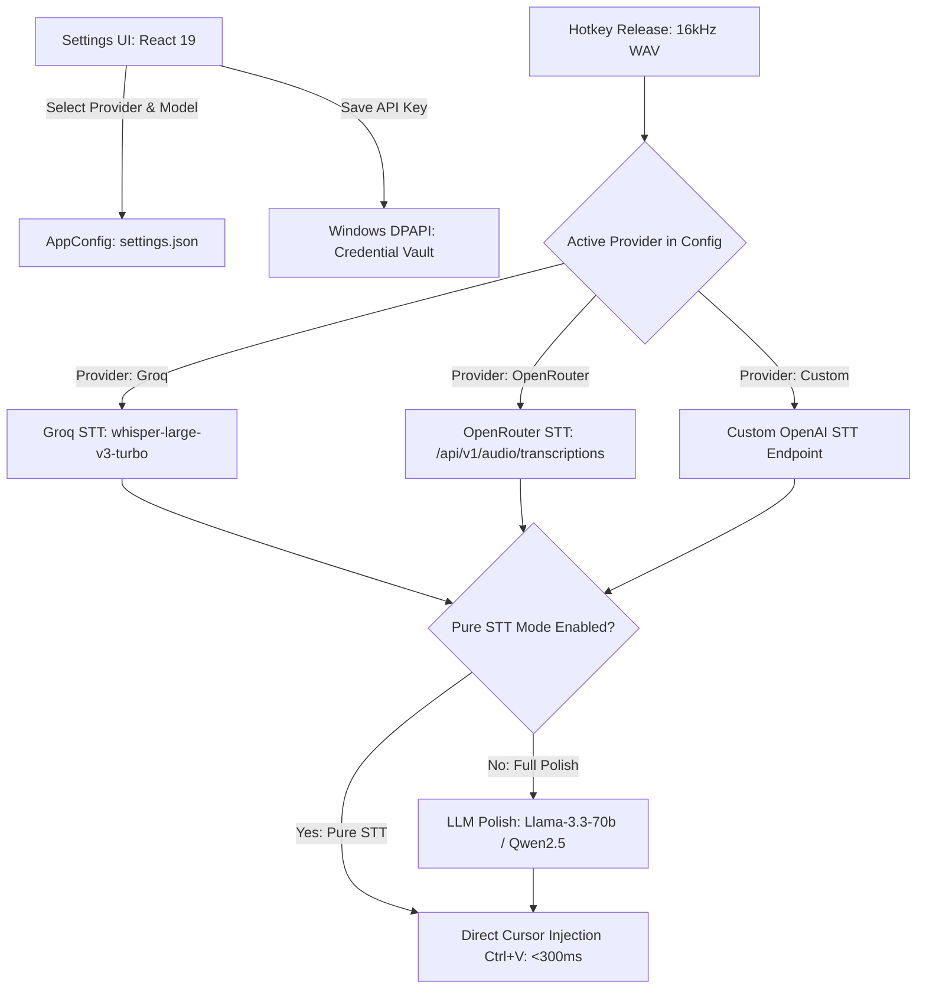

# provider-openrouter-stt-security

## Overview

This plan implements a modular multi-provider AI architecture for `vt-voice`. Users can select between **Groq**, **OpenRouter** (standard OpenAI-compatible API), and **Custom OpenAI Endpoints**, dynamically discover and select Speech-to-Text (STT) models, configure per-provider API keys, and toggle a high-speed **Pure STT mode** (bypassing LLM grammar polish while preserving technical Vietnamese-English code-switching).

User API keys are securely protected using the **Windows Data Protection API (DPAPI)** via the native Windows Credential Manager, isolated per provider, and masked in the presentation layer to eliminate memory and DOM leakage risks.

## Goals

| # | Goal                                                                                                                           | Priority |
| - | ------------------------------------------------------------------------------------------------------------------------------ | -------- |
| 1 | **DPAPI Credential Security**: Isolate per-provider keys in Windows Credential Vault; mask in UI                         | P1       |
| 2 | **OpenRouter Provider Engine**: OpenAI-compatible audio transcription with attribution headers & primed prompt           | P1       |
| 3 | **Dynamic STT Model Discovery**: Query OpenRouter `/api/v1/models?output_modalities=transcription` with local fallback | P1       |
| 4 | **Pure STT Mode**: Toggle bypassing LLM polish for ultra-low-latency direct cursor paste                                 | P2       |
| 5 | **Settings UI Redesign**: Modern React tab for provider switching, key validation, and model selection                   | P2       |
| 6 | **End-to-End Hotkey Integration**: Seamless transcription routing based on active provider configuration                 | P1       |

## Phases

| # | Phase                                                                                         | Status  | Effort | Dependencies |
| - | --------------------------------------------------------------------------------------------- | ------- | ------ | ------------ |
| 1 | [Phase 1: Multi-Provider Key Security &amp; Vault Architecture](./phase-01-start.md)           | Completed | 3h     | []           |
| 2 | [Phase 2: OpenRouter &amp; OpenAI-Compatible STT Engine](./phase-02-openrouter-stt-engine.md)  | Completed | 4h     | [1]          |
| 3 | [Phase 3: Dynamic STT Model Discovery &amp; Caching](./phase-03-model-discovery-cache.md)      | Completed | 3h     | [1, 2]       |
| 4 | [Phase 4: Settings UI Provider &amp; Model Selector](./phase-04-settings-ui-provider-model.md) | Completed | 3h     | [1, 2, 3]    |
| 5 | [Phase 5: Pipeline Integration &amp; Verification](./phase-05-pipeline-integration-e2e.md)     | Completed | 3h     | [1, 2, 3, 4] |

## Architecture & Data Flow

## Security Strategy: API Key Defense in Depth

1. **At Rest**: Windows Credential Vault (DPAPI). Keys are encrypted with AES-256 using keys derived from the user's Windows login credentials in the LSASS subsystem. Zero plaintext keys in `settings.json`.
2. **In Transit (IPC)**: Webview never receives raw plaintext keys on settings load; only receives masked representations (e.g. `sk-or-v1-••••••••4a2f`) or boolean flags (`has_key: true`).
3. **In Memory (Rust)**: Key is fetched directly by the native backend thread immediately before the network request, never stored in static global memory, and scrubbed from log/error payloads.
4. **Network**: TLS 1.3 encryption via `rustls`.

## Success Criteria

- [x] Users can seamlessly toggle between Groq, OpenRouter, and Custom providers in Settings.
- [x] OpenRouter API keys and Groq API keys are independently stored in Windows Credential Vault.
- [x] Available STT models populate dynamically from OpenRouter when connected.
- [x] Pure STT mode outputs accurate technical Vietnamese-English speech without calling LLM.
- [x] API keys remain masked in UI and are never leaked to logs or settings JSON files.
- [x] End-to-end hotkey transcription functions with latency under 1.2s on both Groq and OpenRouter.

## Validation Log
### Verification Results
- Claims checked: 12
- Verified: 12 | Failed: 0 | Unverified: 0
- Tier: Full (5 phases)

### User Validation Decisions (2026-09-04)
1. **Fallback Strategy**: Khong auto-fallback sang Groq khi OpenRouter loi. Hien thi thong bao loi ro rang tren Floating Overlay de nguoi dung nam ro trang thai va chi phi.
2. **Pure STT Processing**: Dan tho truc tiep ket qua tu STT (<250ms), khong qua bat ky bo loc regex hay heuristic nao. Dua hoan toan vao `initial_prompt` de Whisper xu ly chinh xac tu muon tieng Anh.
3. **Credential Portability**: Chi luu tru cuc bo trong Windows Credential Vault (DPAPI), khong ho tro export/import ra file de dam bao an toan tuyet doi cho API key.

### Whole-Plan Consistency Sweep
- Status: Verified - Zero unresolved contradictions.
- All phase requirements align with explicit error reporting, pure raw text injection in Pure STT mode, and DPAPI-only local credential storage.

<!-- slug: provider-openrouter-stt-security -->
