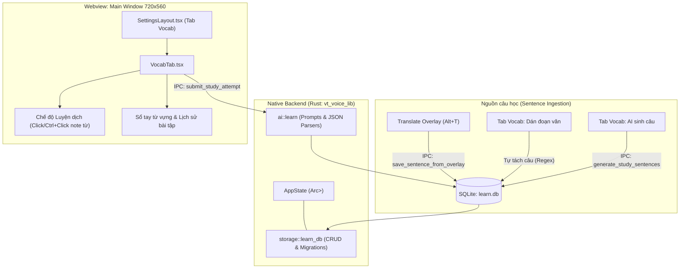

# Thêm Vocab & Học tiếng Anh như một tab trong Settings

## Overview

Kế hoạch này hiện thực hóa tính năng theo [Issue #6](https://github.com/hvantoan/vt-voice/issues/6): Bổ sung tab **Vocab** vào cửa sổ Cài đặt chính (`main` 720x560) của `vt-voice`. Tính năng biến ứng dụng từ một utility gõ giọng nói và dịch nhanh thành một trợ lý học ngoại ngữ toàn diện. Người dùng có thể:
1. Lưu tức thì câu đang dịch từ cửa sổ Translate Overlay (`Alt+T`) vào kho học qua nút action nhanh.
2. Luyện dịch phản xạ (đặc biệt dịch ngược Việt → Anh hoặc Anh → Việt) trong tab Vocab với ô nhập liệu có focus bàn phím chuẩn.
3. Tương tác chọn một từ (Click) hoặc nhiều từ/cụm từ (Ctrl+Click) trực tiếp trên câu nguồn để note lại.
4. Nhận feedback 3 phần từ AI (Điểm/Ngữ pháp - Bản dịch tự nhiên gợi ý - Giải nghĩa từ đã note) chỉ qua 1 request duy nhất.
5. Quản lý Sổ tay từ vựng (Vocab Notebook) và Lịch sử bài tập chi tiết (Attempt History) được lưu bền vững trong CSDL SQLite local (`%APPDATA%/.vt-voice/learn.db`).

CSDL SQLite được khởi tạo ngay lúc ứng dụng khởi động (`AppState`) để Translate Overlay có thể ghi dữ liệu tức thì mà không cần mở trước cửa sổ Cài đặt.

## Goals

| # | Goal | Priority |
|---|------|----------|
| 1 | CSDL SQLite local nhúng qua `rusqlite (bundled)` khởi tạo lúc startup, quản lý 3 bảng: `study_sentences`, `study_attempts`, `saved_vocab` | P1 |
| 2 | Nút "Lưu vào bài học" trên Translate Overlay (`Alt+T`) lưu ngay câu nguồn + bản dịch vào SQLite | P1 |
| 3 | Single-pass AI feedback engine đánh giá ngữ pháp, gợi ý câu chuẩn và giải nghĩa từ đã note trong 1 JSON response | P1 |
| 4 | Tab `Vocab` trong cửa sổ `main` (720x560) với UI tokenized click / Ctrl+click, phân tách đoạn văn và AI sinh câu theo Topic & Level (A1–C2) | P1 |
| 5 | Danh mục Sổ tay từ vựng (Vocab Notebook) và Lịch sử bài tập (Attempt History) có thể xem lại và xóa từ | P2 |
| 6 | Đảm bảo 100% parity song ngữ tiếng Việt & tiếng Anh (`vi.json`, `en.json`) và vượt qua toàn bộ test suite | P1 |

## Architecture Overview

## Phases

| # | Phase | File | Status |
|---|-------|------|--------|
| 1 | [SQLite Backend Core & AppState Setup](./phase-01-sqlite-core.md) | `phase-01-sqlite-core.md` | Complete |
| 2 | [Translate Overlay Quick-Save Action](./phase-02-overlay-save.md) | `phase-02-overlay-save.md` | Complete |
| 3 | [AI Learning Engine & Tauri IPC Commands](./phase-03-ai-feedback.md) | `phase-03-ai-feedback.md` | Complete |
| 4 | [Frontend Vocab Tab in Settings (720x560)](./phase-04-vocab-tab-ui.md) | `phase-04-vocab-tab-ui.md` | Complete |
| 5 | [Localization, Testing & Verification](./phase-05-test-verify.md) | `phase-05-test-verify.md` | Complete |
| 6 | [Structured Evaluation Feedback (Green / Red / Suggestions)](./phase-06-structured-feedback.md) | `phase-06-structured-feedback.md` | Complete |

## Success Criteria

- [X] CSDL SQLite `%APPDATA%/.vt-voice/learn.db` tự động tạo schema 3 bảng khi app khởi động (xác nhận qua `verify_learn_db`).
- [X] API Backend & Frontend wiring cho nút "Lưu vào bài học" trên Translate Overlay (`Alt+T`) lưu câu bôi đen vào SQLite và chống trùng lặp.
- [X] Tab Vocab hiển thị trong danh sách tab của Settings (icon `BookOpen`, nhãn "Từ vựng" / "Vocab").
- [X] Người dùng click hoặc giữ Ctrl+click để chọn các token từ vựng trên câu nguồn, các từ được highlight rõ ràng (xác nhận qua unit tests & tokenization).
- [X] Nộp bài dịch kết nối AI Engine trả về kết quả 3 phần (Điểm/Ngữ pháp - Bản dịch gợi ý - Giải nghĩa từ note).
- [X] Sổ tay từ vựng hiển thị danh sách từ đã lưu, hỗ trợ xóa từ khỏi SQLite (xác nhận qua `verify_learn_db` & component logic).
- [X] `bun test` pass 100% (65/65 tests across 8 files), không lệch key giữa `vi.json` và `en.json`.
- [X] `cd src-tauri && cargo check` biên dịch thành công không có lỗi hoặc cảnh báo nghiêm trọng.
- [ ] Smoke test thủ công trực tiếp trên desktop qua `bun run tauri dev`.

<!-- slug: vocab-learning-tab -->
