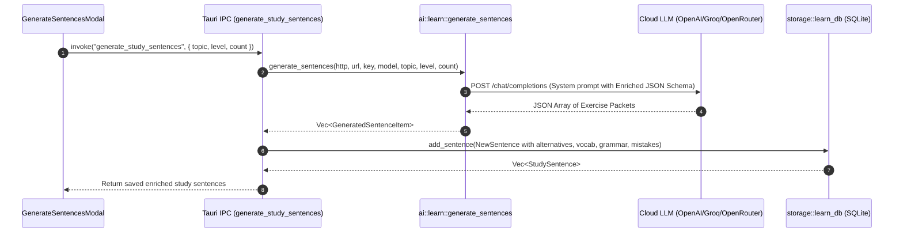

# Phase 1: Pre-generated Packet & SQLite Schema Migration

## Context Links
- Plan Overview: [plan.md](./plan.md)
- Rust DB Module: `src-tauri/src/storage/learn_db.rs`
- AI Learn Module: `src-tauri/src/ai/learn.rs`
- Tauri IPC Command: `src-tauri/src/lib.rs:340`
- Frontend Types: `src/components/settings/vocab/types.ts`

## Overview
- **Priority**: P1 (Critical Foundation)
- **Status**: Todo
- **Description**: Mở rộng schema CSDL SQLite `learn.db` để lưu trữ "Gói bài tập tự trị" (Self-Contained Exercise Packet) gồm câu mẫu chuẩn, các cách dịch thay thế chấp nhận được, danh sách từ vựng mục tiêu, trọng tâm ngữ pháp và các bẫy lỗi thường gặp. Đồng thời nâng cấp prompt và JSON schema trong `generate_sentences` để LLM sinh trọn gói dữ liệu này trong một request duy nhất.

## Key Insights
- Hiện tại bảng `study_sentences` chỉ lưu `source_text`, `reference_translation`, `difficulty_level`, `category`. Khi người dùng nộp bài, hệ thống phải gọi LLM từ đầu để đánh giá ngữ pháp và gợi ý từ vựng.
- Bằng cách bổ sung 4 trường dạng JSON text (`acceptable_alternatives`, `target_vocab`, `grammar_focus`, `common_mistakes`), toàn bộ dữ liệu kiểm tra đã sẵn sàng ngay từ khi câu hỏi được tạo ra.
- Migration phải an toàn tuyệt đối với CSDL hiện có (`ALTER TABLE ... ADD COLUMN` nếu chưa tồn tại), đảm bảo dữ liệu cũ không bị ảnh hưởng.

## Requirements
### Functional Requirements
- [ ] SQLite schema nâng cấp thêm 4 cột mới:
  - `acceptable_alternatives TEXT`: Mảng JSON các câu dịch tương đương hợp lệ (`["They put off...", "They delayed..."]`).
  - `target_vocab TEXT`: Mảng JSON các từ/cụm từ quan trọng kèm từ loại và nghĩa (`[{"word":"postpone","type":"verb","meaning":"hoãn lại"}]`).
  - `grammar_focus TEXT`: Chuỗi mô tả trọng tâm ngữ pháp của câu.
  - `common_mistakes TEXT`: Mảng JSON các lỗi người học hay mắc ở câu này.
- [ ] Cập nhật Rust structs: `StudySentence`, `NewSentence`, `GeneratedSentenceItem`.
- [ ] Cập nhật prompt và schema của `generate_sentences` trong `src-tauri/src/ai/learn.rs` để LLM sinh đủ các trường mới với `temperature: 0.3`.
- [ ] Cập nhật Tauri IPC command `generate_study_sentences` trong `src-tauri/src/lib.rs` để lưu các trường mới vào SQLite.
- [ ] Cập nhật TypeScript interface `StudySentence` và `TargetVocabItem` trong `src/components/settings/vocab/types.ts`.

### Non-functional Requirements
- Tương thích ngược 100% với các câu hỏi cũ đã có trong SQLite (các cột mới có giá trị `NULL` hoặc mảng rỗng `[]`).
- Thời gian thực thi migration `< 10ms` khi khởi động ứng dụng.

## Architecture & Data Flow



## Related Code Files

### Files to Modify
- `src-tauri/src/storage/learn_db.rs` - Migration, struct fields, insert/select queries.
- `src-tauri/src/ai/learn.rs` - Prompt, JSON schema, `GeneratedSentenceItem` parser.
- `src-tauri/src/lib.rs` - Command `generate_study_sentences` mapping.
- `src/components/settings/vocab/types.ts` - TypeScript interface `StudySentence`, `TargetVocabItem`.

## File Inventory Table

| File | Action | Description | Test Impact |
|---|---|---|---|
| `src-tauri/src/storage/learn_db.rs` | Modify | Thêm 4 cột vào `study_sentences`, update CRUD queries | Unit tests trong `learn_db.rs` |
| `src-tauri/src/ai/learn.rs` | Modify | Update prompt và parsing logic cho `generate_sentences` | Unit tests `tests::test_generate_sentences_prompt` |
| `src-tauri/src/lib.rs` | Modify | Map các trường mới trong command `generate_study_sentences` | IPC verification |
| `src/components/settings/vocab/types.ts` | Modify | Thêm `TargetVocabItem`, cập nhật `StudySentence` | TypeScript typecheck (`bun run build`) |

## Implementation Steps

1. **SQLite Schema Migration (`learn_db.rs`)**:
   - Trong `run_migrations()`, thêm kiểm tra và lệnh `ALTER TABLE study_sentences ADD COLUMN ...` an toàn:
     ```sql
     ALTER TABLE study_sentences ADD COLUMN acceptable_alternatives TEXT;
     ALTER TABLE study_sentences ADD COLUMN target_vocab TEXT;
     ALTER TABLE study_sentences ADD COLUMN grammar_focus TEXT;
     ALTER TABLE study_sentences ADD COLUMN common_mistakes TEXT;
     ```
   - Xử lý lỗi nếu cột đã tồn tại (bỏ qua `duplicate column name` error).
2. **Cập nhật Structs trong `learn_db.rs`**:
   - Thêm các trường vào `StudySentence` và `NewSentence`:
     - `pub acceptable_alternatives: Option<String>`
     - `pub target_vocab: Option<String>`
     - `pub grammar_focus: Option<String>`
     - `pub common_mistakes: Option<String>`
   - Cập nhật các câu lệnh `INSERT INTO study_sentences` và `SELECT` trong `add_sentence`, `list_sentences`, `get_sentence`.
3. **Cập nhật AI Generator (`ai/learn.rs`)**:
   - Mở rộng `GeneratedSentenceItem`:
     ```rust
     pub struct GeneratedSentenceItem {
         pub source_text: String,
         pub reference_translation: Option<String>,
         pub acceptable_alternatives: Option<Vec<String>>,
         pub target_vocab: Option<Vec<TargetVocabItem>>,
         pub grammar_focus: Option<String>,
         pub common_mistakes: Option<Vec<String>>,
         pub difficulty_level: Option<String>,
         pub category: Option<String>,
     }
     ```
   - Cập nhật `system_prompt` của `generate_sentences` để yêu cầu trả về các trường trên theo định dạng JSON nghiêm ngặt.
4. **Cập nhật IPC Command (`lib.rs`)**:
   - Serialize các mảng Rust thành JSON chuỗi khi ghi vào `NewSentence`.
5. **Cập nhật Frontend Types (`types.ts`)**:
   - Định nghĩa `TargetVocabItem`:
     ```typescript
     export interface TargetVocabItem {
       word: string;
       type?: string;
       meaning: string;
     }
     ```
   - Cập nhật `StudySentence`:
     ```typescript
     export interface StudySentence {
       // ... existing fields
       acceptableAlternatives?: string[] | null;
       targetVocab?: TargetVocabItem[] | null;
       grammarFocus?: string | null;
       commonMistakes?: string[] | null;
     }
     ```

## Test Scenario Matrix

| ID | Path | Priority | Scenario Description | Expected Outcome |
|---|---|---|---|---|
| TS-P1-01 | Migration | Critical | Mở DB cũ chưa có 4 cột mới | `run_migrations` thêm 4 cột thành công, không văng lỗi |
| TS-P1-02 | Migration Idempotency | High | Chạy `run_migrations` lần thứ hai trên DB đã có cột | Không văng lỗi duplicate column |
| TS-P1-03 | Add & Get Sentence | Critical | Thêm câu mới có đủ 4 trường và lấy lại từ SQLite | Đọc ra đầy đủ các trường JSON |
| TS-P1-04 | AI JSON Parsing | Critical | LLM trả về JSON chứa `acceptableAlternatives`, `targetVocab` | Deserialize thành công vào `GeneratedSentenceItem` |
| TS-P1-05 | Backward Compat | High | Đọc các câu cũ có giá trị `NULL` ở 4 trường mới | Deserialize ra `None` / `undefined`, không crash |

## Todo List
- [ ] Viết migration mở rộng bảng `study_sentences` trong `learn_db.rs`
- [ ] Cập nhật `StudySentence` và `NewSentence` structs cùng các hàm query trong `learn_db.rs`
- [ ] Cập nhật `GeneratedSentenceItem` và `generate_sentences` prompt trong `ai/learn.rs`
- [ ] Cập nhật command `generate_study_sentences` trong `lib.rs`
- [ ] Cập nhật `types.ts` trên frontend với `TargetVocabItem` và các trường mở rộng
- [ ] Kiểm tra biên dịch `cargo check` và typecheck `bun run build`

## Success Criteria
- [ ] Chạy `cargo check` biên dịch sạch sẽ không có cảnh báo nghiêm trọng.
- [ ] Các unit test trong `learn_db.rs` kiểm tra insert/select các trường mới đều pass.
- [ ] Frontend `bun run build` hoàn thành không có lỗi type mismatch.

## Risk Assessment
- **Risk**: Một số LLM (đặc biệt các model nhỏ hoặc prompt yếu) có thể trả về JSON thiếu một số trường mới.
  - *Mitigation*: Đặt tất cả các trường mới là `Option<T>` / optional fields với fallback giá trị mặc định là `None` / `[]` để không bao giờ làm đứt luồng sinh câu.

## Security Considerations
- Tất cả dữ liệu đầu vào từ LLM đều được parse qua `serde_json` với schema chặt chẽ, loại bỏ hoàn toàn nguy cơ SQL injection bằng cách sử dụng parameterized queries (`rusqlite::params!`).

## Next Steps
- Chuyển sang **Phase 2: Local Instant Evaluation Engine** để xây dựng các thuật toán so khớp chuỗi, Damerau-Levenshtein và Myers Token Diff trên client.
