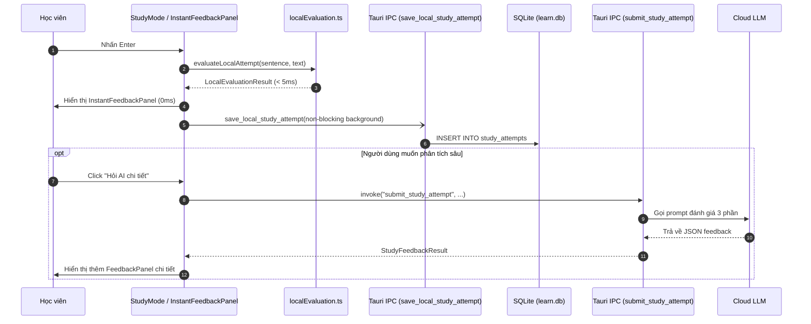

# Phase 4: On-Demand Deep AI & Attempt Persistence

## Context Links
- Plan Overview: [plan.md](./plan.md)
- Pre-requisites: [Phase 1](./phase-01-start.md), [Phase 2](./phase-02-local-eval-engine.md), [Phase 3](./phase-03-instant-feedback-ui.md)
- Backend Command: `src-tauri/src/lib.rs:submit_study_attempt`
- Database Storage: `src-tauri/src/storage/learn_db.rs:add_attempt`
- Frontend Components: `src/components/settings/vocab/StudyMode.tsx`, `FeedbackPanel.tsx`

## Overview
- **Priority**: P1 (Hybrid Architecture Completion)
- **Status**: Todo
- **Description**: Tách biệt hoàn toàn luồng đánh giá tức thì (Local Evaluation) khỏi luồng phân tích sâu của AI (Deep LLM Feedback). Người dùng không còn bị ép phải chờ LLM, nhưng bất kỳ lúc nào muốn hiểu sâu ("Tại sao câu này sai?", "Có cách diễn đạt nào tự nhiên hơn?"), họ có thể bấm nút "Hỏi AI chi tiết". Đồng thời, lượt làm bài tức thì được tự động lưu bền vững vào CSDL SQLite (`study_attempts`) ở chế độ chạy ngầm (non-blocking background save).

## Key Insights
- Trước đây, `submit_study_attempt` vừa gọi LLM vừa lưu SQLite. Nếu bỏ qua bước gọi LLM ở phím `Enter` thì lượt làm bài sẽ chưa được lưu vào bảng `study_attempts`.
- Cần có một lệnh IPC riêng `save_local_study_attempt` để ghi kết quả đánh giá cục bộ vào SQLite ngay khi hoàn tất chấm điểm, đảm bảo Lịch sử làm bài (Attempt History) luôn đầy đủ.
- Khi người dùng bấm "Hỏi AI chi tiết", request gọi LLM chạy bất đồng bộ (async), hiển thị spinner cục bộ bên trong nút bấm hoặc drawer, tuyệt đối không khóa ô nhập liệu hay ngăn cản người dùng chuyển câu.

<!-- Updated: Validation Session 1 - Reuse active Polish AI Provider config -->
## Requirements
### Functional Requirements
- [ ] Bổ sung Tauri IPC command `save_local_study_attempt`:
  - Nhận tham số: `sentenceId`, `userTranslation`, `grammarScore`, `feedbackSummary`, `improvedVersion`.
  - Ghi vào bảng `study_attempts` trong SQLite.
- [ ] Tích hợp tính năng "Hỏi AI chi tiết" trong `InstantFeedbackPanel.tsx`:
  - Nút bấm *"Hỏi AI chi tiết"* kèm icon `Sparkles`.
  - Khi click: Kích hoạt gọi `submit_study_attempt` bất đồng bộ.
  - Hiển thị trạng thái đang tải (`isAiLoading`) cục bộ trong panel.
  - Khi có kết quả từ AI: Hiển thị thêm khối nhận xét 3 phần của AI (`FeedbackPanel`) ngay bên dưới Token Diff.
  - Tái sử dụng cấu hình AI provider và model hiện tại của tính năng Polish (`AppState.config.ai`), không phát sinh cài đặt phức tạp riêng biệt cho Vocab.
- [ ] Lưu và khôi phục trạng thái (Cache & Restore):
  - Khi người dùng quay lại câu đã làm: Khôi phục kết quả chấm điểm tức thì từ cache bộ nhớ (`cacheRef`) hoặc từ bản ghi gần nhất trong SQLite.

### Non-functional Requirements
- Thao tác lưu SQLite chạy ngầm không làm đơ giao diện (`< 1ms`).
- Gọi AI chuyên sâu có cơ chế timeout an toàn (30s) và hiển thị thông báo lỗi thân thiện nếu mất mạng.

## Architecture & Data Flow



## Related Code Files

### Files to Modify
- `src-tauri/src/lib.rs` - Thêm command `save_local_study_attempt`.
- `src/components/settings/vocab/StudyMode.tsx` - Tích hợp lưu ngầm và kích hoạt on-demand AI.
- `src/components/settings/vocab/InstantFeedbackPanel.tsx` - Gắn nút và sự kiện "Hỏi AI".
- `src/components/settings/vocab/FeedbackPanel.tsx` - Cho phép nhúng hoặc hiển thị mở rộng.

## File Inventory Table

| File | Action | Description | Test Impact |
|---|---|---|---|
| `src-tauri/src/lib.rs` | Modify | Thêm `save_local_study_attempt` command | IPC invoke tests |
| `src/components/settings/vocab/StudyMode.tsx` | Modify | Quản lý state on-demand AI & non-blocking save | UI workflow integration |
| `src/components/settings/vocab/InstantFeedbackPanel.tsx` | Modify | Thêm trigger "Hỏi AI chi tiết" | Component interaction |

## Implementation Steps

1. **Thêm IPC Command `save_local_study_attempt` (`src-tauri/src/lib.rs`)**:
   ```rust
   #[tauri::command]
   fn save_local_study_attempt(
       state: State<'_, AppState>,
       sentence_id: String,
       user_translation: String,
       grammar_score: Option<i32>,
       feedback_text: String,
       improved_version: Option<String>,
   ) -> Result<storage::StudyAttempt, String> {
       let db = state.learn_db.lock();
       db.add_attempt(storage::NewAttempt {
           sentence_id: Some(sentence_id),
           user_translation,
           grammar_score,
           feedback_text,
           improved_version,
       })
       .map_err(|e| e.to_string())
   }
   ```
   - Đăng ký command vào danh sách `invoke_handler` trong `lib.rs`.
2. **Kích hoạt lưu ngầm trong `StudyMode.tsx`**:
   - Ngay sau khi `evaluateLocalAttempt` trả về kết quả, gọi `invoke("save_local_study_attempt", ...)` dạng fire-and-forget mà không `await` chặn luồng UI.
3. **Xây dựng luồng On-Demand AI Feedback**:
   - Thêm state `isAiLoading: boolean` và `deepAiFeedback: StudyFeedbackResult | null`.
   - Khi bấm "Hỏi AI chi tiết", gọi `invoke("submit_study_attempt", ...)` và cập nhật `deepAiFeedback`.

## Test Scenario Matrix

| ID | Path | Priority | Scenario Description | Expected Outcome |
|---|---|---|---|---|
| TS-P4-01 | Local Attempt Saved | Critical | Nhấn Enter nộp bài tức thì | Bảng `study_attempts` có bản ghi mới với đúng điểm số |
| TS-P4-02 | On-Demand Trigger | High | Bấm "Hỏi AI chi tiết" | Gửi request lên LLM, hiển thị spinner riêng trong panel |
| TS-P4-03 | Non-blocking Nav | Critical | Đang đợi AI trả lời, bấm Next sang câu khác | Chuyển câu bình thường, không bị kẹt hay treo ứng dụng |
| TS-P4-04 | Deep Feedback Render | High | AI trả lời thành công | Khối nhận xét 3 phần hiển thị mượt mà bên dưới Token Diff |

## Todo List
- [x] Viết command `save_local_study_attempt` và đăng ký trong `src-tauri/src/lib.rs`
- [x] Kết nối hàm lưu ngầm vào `StudyMode.tsx` khi có kết quả đánh giá cục bộ
- [x] Gắn nút "Hỏi AI chi tiết" trong `InstantFeedbackPanel.tsx`
- [x] Kiểm tra lịch sử làm bài trong tab History sau khi làm bài tức thì

## Success Criteria
- [ ] Lượt làm bài tức thì xuất hiện trong danh mục Lịch sử làm bài (`Attempt History`) với điểm số chính xác.
- [ ] Nút "Hỏi AI chi tiết" hoạt động ổn định và không bao giờ cản trở tốc độ chuyển câu.

## Risk Assessment
- **Risk**: Người dùng bấm "Hỏi AI" nhiều lần liên tục gây spam request.
  - *Mitigation*: Disable nút "Hỏi AI" và hiển thị trạng thái `isAiLoading` ngay sau lần click đầu tiên.

## Security Considerations
- Dữ liệu lưu vào SQLite sử dụng parameterized query, an toàn trước SQL injection.

## Next Steps
- Chuyển sang **Phase 5: Testing, Benchmarking & Localization** để hoàn thiện bộ kiểm thử tự động, đo lường độ trễ và đồng bộ song ngữ.
