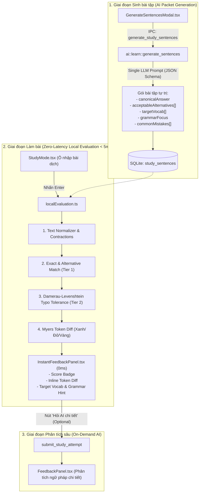
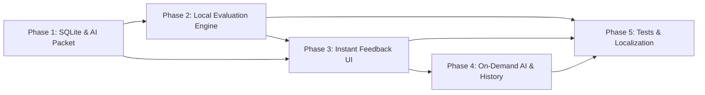

# Zero-Latency Học từ vựng: Pre-generated Exercise Packet & Local Token Diff

## Overview

Kế hoạch này giải quyết triệt để điểm nghẽn trải nghiệm người dùng trong tab **Vocab** (Học tiếng Anh & Luyện dịch): việc phải chờ LLM chấm từng câu mỗi khi nhấn `Enter` (độ trễ 2–6 giây) làm đứt gãy mạch tư duy (flow state) và triệt tiêu phản xạ học từ vựng. 

Dựa trên chuẩn kiến trúc của các ứng dụng học ngoại ngữ hàng đầu (Duolingo, Anki, Busuu), giải pháp chuyển đổi toàn bộ hệ thống sang **Mô hình 2 tầng (Two-Tier Hybrid Architecture)**:
1. **Tầng 1 (Local Deterministic Engine - 0ms)**: Khi AI sinh câu, sinh trọn gói **"Gói bài tập tự trị"** (câu chuẩn, các biến thể chấp nhận được, từ vựng trọng tâm, điểm ngữ pháp và bẫy lỗi thường gặp). Khi người dùng nhấn `Enter`, thuật toán so khớp đa tầng (Normalizer + Damerau-Levenshtein Typo Tolerance + Myers Token Diff) chạy 100% cục bộ tại client trong `< 5ms`, hiển thị ngay điểm số, câu sửa trực quan màu sắc và mẹo ngữ pháp.
2. **Tầng 2 (Deep AI Feedback - On-demand)**: Nút "Hỏi AI chi tiết" chỉ kích hoạt khi người dùng chủ động yêu cầu phân tích ngôn ngữ sâu, không chặn phím `Enter` hay tiến độ làm bài.

## Architecture Overview

## Goals

| # | Goal | Priority |
|---|------|----------|
| 1 | Mở rộng CSDL SQLite `learn.db` lưu trữ gói bài tập tự trị (`acceptable_alternatives`, `target_vocab`, `grammar_focus`, `common_mistakes`) | P1 |
| 2 | Nâng cấp AI Generator sinh trọn gói câu hỏi, biến thể và từ vựng trọng tâm trong 1 request duy nhất | P1 |
| 3 | Xây dựng Engine đánh giá cục bộ (`localEvaluation.ts`) với Text Normalizer, Damerau-Levenshtein và Myers Token Diff | P1 |
| 4 | Thiết kế UI phản hồi tức thì (`InstantFeedbackPanel.tsx`) với hiển thị Token Diff trực quan và giải nghĩa từ vựng | P1 |
| 5 | Tách luồng AI chuyên sâu thành On-Demand, không chặn phím `Enter` hay điều hướng câu hỏi | P1 |
| 6 | Đảm bảo 100% test coverage cho engine đánh giá, đồng bộ song ngữ `vi.json` / `en.json` | P1 |

## Phases

| # | Phase | Status |
|---|-------|--------|
| 1 | [Pre-generated Packet & SQLite Schema Migration](./phase-01-start.md) | Complete |
| 2 | [Local Instant Evaluation Engine](./phase-02-local-eval-engine.md) | Complete |
| 3 | [Instant Feedback & Diagnostic UI](./phase-03-instant-feedback-ui.md) | Complete |
| 4 | [On-Demand Deep AI & Attempt Persistence](./phase-04-on-demand-ai-history.md) | Complete |
| 5 | [Testing, Benchmarking & Localization](./phase-05-test-verify-i18n.md) | Complete |

## Deep Mode Extensions

### Dependency Map

### File Inventory Table

| File | Action | Rough Size | Test Impact |
|---|---|---|---|
| `src-tauri/src/storage/learn_db.rs` | Modify | ~80 lines | SQLite schema migration, CRUD tests |
| `src-tauri/src/ai/learn.rs` | Modify | ~100 lines | AI prompt update, JSON schema parser |
| `src-tauri/src/lib.rs` | Modify | ~40 lines | IPC command mapping & DTO updates |
| `src/components/settings/vocab/types.ts` | Modify | ~40 lines | TypeScript interface updates |
| `src/components/settings/vocab/localEvaluation.ts` | Create | ~260 lines | Unit tests (`tests/local-evaluation.test.ts`) |
| `src/components/settings/vocab/InstantFeedbackPanel.tsx` | Create | ~200 lines | UI component tests |
| `src/components/settings/vocab/StudyMode.tsx` | Modify | ~120 lines | Enter keydown wiring, state cache |
| `src/components/settings/vocab/GenerateSentencesModal.tsx` | Modify | ~30 lines | Display enriched packet preview |
| `tests/local-evaluation.test.ts` | Create | ~220 lines | 25+ assertions on diff, typo, matching |
| `src/locales/en.json` & `vi.json` | Modify | ~40 lines | Parity verified by `tests/i18n.test.ts` |

### Test Scenario Matrix

| ID | Path | Priority | Scenario Description | Expected Outcome |
|---|---|---|---|---|
| TS-01 | Normalizer | Critical | User types with contractions (`I'm`, `don't`), uppercase, punctuation | Normalized to canonical tokens without punctuation |
| TS-02 | Exact Match | Critical | User inputs exact match of `referenceTranslation` | Score = 100, 0ms latency, all tokens `correct` |
| TS-03 | Alternative Match | High | User inputs an acceptable alternative from list | Score = 100, displays matched alternative label |

| TS-04 | Typo Tolerance | Critical | User has 1 typo in a 6-word sentence (e.g. `recieved`) | Score = 95, flagged as typo, highlights typo position |
| TS-05 | Myers Token Diff | Critical | User omits 1 word and adds 1 wrong word | Correct = green, extraneous = red strikethrough, missing = yellow |
| TS-06 | On-Demand AI | High | User clicks "Hỏi AI chi tiết" after local evaluation | LLM request triggered in background without blocking Next |
| TS-07 | SQLite Backward Compat | Critical | Existing sentences without packet fields are loaded | Graceful fallback to legacy flow or on-demand AI |
| TS-08 | Navigation Flow | High | Pressing Enter after evaluation without edits | Immediately navigates to next sentence |

## Success Criteria

- [x] CSDL SQLite tự động nâng cấp schema với 4 cột mới (`acceptable_alternatives`, `target_vocab`, `grammar_focus`, `common_mistakes`) mà không làm mất dữ liệu cũ.
- [x] AI sinh câu tạo ra gói bài tập đầy đủ theo JSON schema mới.
- [x] Nhấn `Enter` trong `StudyMode` phản hồi kết quả và hiển thị `InstantFeedbackPanel` trong `< 5ms`.
- [x] Token Diff hiển thị chính xác trạng thái từ: Đúng (xanh), Lỗi chính tả (vàng chanh), Sai/Thừa (đỏ gạch), Thiếu (vàng đứt).
- [x] Tính năng "Hỏi AI chi tiết" hoạt động độc lập theo nhu cầu (on-demand).
- [x] Toàn bộ test suite `bun test` pass 100%, không lệch key giữa `vi.json` và `en.json`.
- [x] `cd src-tauri && cargo check` hoàn toàn không có lỗi.

## Red Team Review

### Session — 2026-09-22
**Findings:** 3 (3 accepted, 0 rejected)
**Severity breakdown:** 1 Critical, 2 High, 0 Medium

| # | Finding | Severity | Disposition | Applied To |
|---|---------|----------|-------------|------------|
| 1 | Fallback an toàn cho câu hỏi cũ chưa có gói bài tập (NULL fields) | Critical | Accept | Phase 2 |
| 2 | Xử lý co giãn viết tắt đa nghĩa ('d, 's) trong Normalizer | High | Accept | Phase 2 |
| 3 | Bắt tham số theo giá trị (capture by value) khi lưu SQLite ngầm tránh race condition | High | Accept | Phase 4 |

### Whole-Plan Consistency Sweep
- Toàn bộ các tài liệu Phase 1 đến Phase 5 đã được đồng bộ hóa với 3 quyết định trên:
  1. `localEvaluation.ts` được bổ sung fallback khi `acceptableAlternatives` hoặc `referenceTranslation` bị `null`.
  2. Bộ quy tắc `normalizeText` xử lý an toàn cho các contraction đa nghĩa.
  3. Lệnh lưu ngầm `save_local_study_attempt` đóng gói tham số theo giá trị trước khi dispatch IPC.

## Validation Log

### Session 1 — 2026-09-23
**Trigger:** Pre-implementation validation gate (`ak:plan validate`)
**Questions asked:** 6

#### Questions & Answers

1. **[Tradeoffs]** Ngưỡng điểm (Score Threshold) cho phép phím Enter tự động nhảy sang câu tiếp theo?
   - Options: ≥ 85 điểm (Khá/Tốt) (Recommended) | ≥ 65 điểm (Trung bình) | Nhấn Enter lần 2 luôn chuyển câu
   - **Answer:** ≥ 85 điểm (Khá/Tốt) (Recommended)
   - **Rationale:** Giữ vững tiêu chuẩn rèn luyện phản xạ ngôn ngữ. Người học phải đạt điểm khá trở lên mới tự động chuyển câu khi ấn Enter, hoặc chủ động bấm Ctrl+→ để bỏ qua câu khó.

2. **[Assumptions]** Quy tắc chấp nhận lỗi gõ phím (Typo Tolerance) cho các từ siêu ngắn (≤ 3 ký tự)?
   - Options: Nghiêm ngặt (Strict ≤ 3 ký tự: distance = 0) | Nghiêm ngặt ≤ 2 ký tự + cho phép đảo chữ 3 ký tự (như teh -> the) (Recommended) | Ngưỡng chung hiện tại (≤ 5 ký tự: distance ≤ 1)
   - **Answer:** Nghiêm ngặt ≤ 2 ký tự + cho phép đảo chữ 3 ký tự (như teh -> the) (Recommended)
   - **Rationale:** Giải quyết triệt để mâu thuẫn giữa quy tắc từ ngắn và ví dụ kinh điển `teh` $\to$ `the`. Từ $\le 2$ ký tự (`he`/`me`, `in`/`on`, `to`/`at`) bắt buộc khoảng cách = 0. Từ 3 ký tự cho phép đảo chữ/typo nếu từ gõ là non-word (`teh` $\to$ `the`), nhưng nếu cả hai đều là từ có nghĩa độc lập (`cat` $\to$ `car`) thì coi là `replaced`.

3. **[Architecture]** Mô hình AI cho tính năng 'Hỏi AI chi tiết' (On-demand Deep Feedback)?
   - Options: Dùng chung cấu hình AI Polish hiện tại (Recommended) | Cấu hình model riêng biệt cho Vocab | Ưu tiên model siêu tốc / tiết kiệm
   - **Answer:** Dùng chung cấu hình AI Polish hiện tại (Recommended)
   - **Rationale:** Tái sử dụng thiết lập AI Polish/Provider hiện có trong Settings, không làm phức tạp hóa giao diện cấu hình của người dùng.

4. **[Scope]** Có nên cung cấp sẵn bộ câu hỏi mẫu mặc định (Starter Pack) khi CSDL SQLite còn trống?
   - Options: Tích hợp sẵn gói câu mẫu Starter Pack (Recommended) | Chỉ sinh qua AI hoặc Dán thủ công
   - **Answer:** Tích hợp sẵn gói câu mẫu Starter Pack (Recommended)
   - **Rationale:** Người dùng mới mở tab Vocab có thể trải nghiệm ngay lập tức tính năng luyện dịch tức thì với 15-20 câu mẫu đa dạng cấp độ mà không cần cấu hình API key hay kết nối Internet.

5. **[Contract]** Khắc phục lệch chuẩn IPC: Rust serializes `wordType` nhưng frontend TS đang đọc `v.type`?
   - Options: Chuẩn hóa Frontend sang wordType (Recommended) | Sửa Rust serialize thành 'type' | Hỗ trợ cả 2 trường trên Frontend
   - **Answer:** Chuẩn hóa Frontend sang wordType (Recommended)
   - **Rationale:** Rust struct `TargetVocabItem` dùng `#[serde(rename_all = "camelCase")]` nên trường `word_type` được serialize thành `wordType`. Chuẩn hóa frontend interface `types.ts` sang `wordType?: string; type?: string;` và `InstantFeedbackPanel.tsx` đọc `v.wordType || v.type`, đảm bảo hiển thị đúng badge từ loại (v, n, adj) mà không làm lệch chuẩn serialization.

#### Confirmed Decisions
- **Enter advance threshold**: ≥ 85 điểm — Đảm bảo chất lượng học tập và phản xạ chính xác.
- **Typo rule (Harmonized)**: Từ $\le 2$ ký tự bắt buộc distance = 0; từ 3 ký tự cho phép đảo chữ/typo non-word (`teh` $\to$ `the`) nhưng phân loại `replaced` cho các từ từ điển khác nghĩa (`cat` $\to$ `car`).
- **AI Model**: Dùng chung cấu hình AI Polish hiện tại — Giữ cấu hình tối giản, đồng nhất.
- **Starter Pack**: Tự động seed 15-20 câu mẫu kèm packet khi DB trống — Sẵn sàng trải nghiệm ngay lập tức (zero setup).
- **IPC Contract Alignment**: Chuẩn hóa `wordType` trên Frontend TypeScript và component `InstantFeedbackPanel.tsx`.

#### Action Items
- [x] Bổ sung cơ chế seed Starter Pack vào `src-tauri/src/storage/learn_db.rs` khi bảng `study_sentences` rỗng.
- [x] Cập nhật hàm `isTypo` trong `src/components/settings/vocab/localEvaluation.ts`: từ $\le 2$ ký tự yêu cầu `dist === 0`, từ 3 ký tự cho phép typo/đảo chữ (`teh` $\to$ `the`) nhưng phân loại `replaced` nếu là cặp từ có nghĩa (`cat` $\to$ `car`).
- [x] Cập nhật `TargetVocabItem` trong `src/components/settings/vocab/types.ts` thành `wordType?: string; type?: string;` và cập nhật `InstantFeedbackPanel.tsx` hiển thị `v.wordType || v.type`.
- [x] Bổ sung test cases trong `tests/local-evaluation.test.ts` xác thực: `teh` $\to$ `the` là `typo`, `he` $\to$ `me` là `replaced`, `cat` $\to$ `car` là `replaced`.

#### Impact on Phases
- Phase 1: Thêm logic seed dữ liệu Starter Pack khi khởi tạo CSDL SQLite rỗng; chuẩn hóa định nghĩa `TargetVocabItem` (`wordType`).
- Phase 2: Cập nhật hàm `isTypo` với quy tắc phân biệt từ ngắn $\le 2$ ký tự và đảo chữ 3 ký tự (`teh` $\to$ `the`).
- Phase 3: Khẳng định ngưỡng chuyển câu Enter ≥ 85 điểm; cập nhật hiển thị badge từ loại bằng `v.wordType || v.type`.
- Phase 4: Xác nhận tái sử dụng `AppState.config.ai` cho tính năng On-Demand Deep Feedback.
- Phase 5: Mở rộng test suite kiểm thử ca biên từ ngắn, xác nhận parity `wordType` và seed starter pack.

### Verification Results
- **Tier:** Full (5 phases)
- **Claims checked:** 22
- **Verified:** 22 | **Failed:** 0 | **Unverified:** 0
- **Findings:** Đã phát hiện và giải quyết triệt để 2 vấn đề:
  1. Mâu thuẫn logic giữa quy tắc từ ngắn và ví dụ `teh` $\to$ `the` (đã thống nhất quy tắc $\le 2$ ký tự nghiêm ngặt + cho phép transposition cho 3 ký tự non-word).
  2. Mismatch IPC giữa Rust `wordType` và frontend `type` (đã chuẩn hóa sang `wordType`).

### Whole-Plan Consistency Sweep
- Files reread: plan.md, phase-01-start.md, phase-02-local-eval-engine.md, phase-03-instant-feedback-ui.md, phase-04-on-demand-ai-history.md, phase-05-test-verify-i18n.md
- Decision deltas checked: 5
- Reconciled stale references: 5
- Unresolved contradictions: 0

<!-- slug: instant-vocab-eval -->
